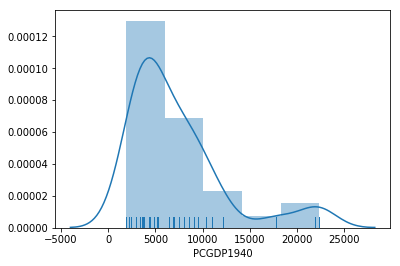
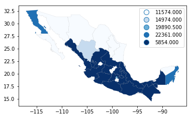

---
redirect_from:
  - "/notebooks/05-choropleth"
interact_link: content/notebooks/05_choropleth.ipynb
kernel_name: python3
has_widgets: false
title: 'Choropleth Mapping'
prev_page:
  url: /intro_part_ii
  title: 'Part II - Spatial Data Analysis'
next_page:
  url: /notebooks/06_spatial_autocorrelation
  title: 'Spatial Autocorrelation'
comment: "***PROGRAMMATICALLY GENERATED, DO NOT EDIT. SEE ORIGINAL FILES IN /content***"
---

<div markdown="1" class="cell code_cell">
<div class="input_area" markdown="1">
```python
# Choropleth mapping


```
</div>

</div>

<div markdown="1" class="cell code_cell">
<div class="input_area" markdown="1">
```python
%matplotlib inline

import seaborn
import pandas
import geopandas
import pysal
import numpy
from booktools import choropleth
from pysal.viz.mapclassify import classifiers as mapclassify
import matplotlib.pyplot as plt
```
</div>

</div>

## Principles


Choropleth maps play a prominent role in geographic data science as they allow us to display non-geographic attributes or variables on a geographic map. The word
choropleth stems from the root "choro", meaning "region". As such choropleth maps
represent data at the region level, and
are appropriate for areal unit data where each observation combines a value of
an attribute and a geometric figure, usually a polygon. Choropleth maps derive from an earlier era where
cartographers faced technological constraints that precluded the use of
unclassed maps where each unique attribute value could be represented by a
distinct symbol or color. Instead, attribute values were grouped into a smaller number of
classes, usually not more than 12. Each class was associated with a unique symbol that was in turn
applied to all observations with attribute values falling in the class.

Although today these technological constraints are no longer binding, and
unclassed mapping is feasible, there are still good reasons for adopting a
classed approach. Chief among these is to reduce the cognitive load involved in
parsing the complexity of an unclassed map. A choropleth map reduces this
complexity by drawing upon statistical and visualization theory to provide an
effective representation of the spatial distribution of the attribute values
across the areal units. 

The effectiveness of a choropleth map will be a
function of the choice of classification scheme together with the color or
symbolization strategy adopted. In broad terms, the classification scheme
defines the number of classes as well as the rules for assignment, while the
symbolization should convey information about the value differentiation across
the classes.

In this chapter we first discuss the approaches used to classify
attribute values. This is followed by an overview of color theory and the
implications of different color schemes for effective map design. We  combine
theory and practice by exploring how these concepts are implemented in different Python packages, including `geopandas`, and `PySAL`.


## Quantitative data classification

Data classification considers the problem of 
partitioning the attribute values into mutually exclusive and exhaustive
groups. The precise manner in which this is done will be a function of the
measurement scale of the attribute in question. For quantitative attributes
(ordinal, interval, ratio scales) the classes will have an explicit ordering.
More formally, the classification problem is to define class boundaries such
that
$$
c_j < y_i \le  c_{j+1} \ \forall y_i \in C_{j+1}
$$
where $y_i$ is the
value of the attribute for spatial location $i$, $j$ is a class index, and $c_j$
represents the lower bound of interval $j$.

Different classification schemes obtain from their definition of the class
boundaries. The choice of the classification scheme should take into
consideration the statistical distribution of the attribute values.

To illustrate these considerations, we will examine regional income data for the
32 Mexican states. The variable we focus on is per capita gross domestic product
for 1940 (PCGDP1940):

<div markdown="1" class="cell code_cell">
<div class="input_area" markdown="1">
```python
mx = geopandas.read_file("../data/mexicojoin.shp")
mx[['NAME', 'PCGDP1940']].head()
```
</div>

<div class="output_wrapper" markdown="1">
<div class="output_subarea" markdown="1">


<div markdown="0" class="output output_html">
<div>
<style scoped>
    .dataframe tbody tr th:only-of-type {
        vertical-align: middle;
    }

    .dataframe tbody tr th {
        vertical-align: top;
    }

    .dataframe thead th {
        text-align: right;
    }
</style>
<table border="1" class="dataframe">
  <thead>
    <tr style="text-align: right;">
      <th></th>
      <th>NAME</th>
      <th>PCGDP1940</th>
    </tr>
  </thead>
  <tbody>
    <tr>
      <th>0</th>
      <td>Baja California Norte</td>
      <td>22361.0</td>
    </tr>
    <tr>
      <th>1</th>
      <td>Baja California Sur</td>
      <td>9573.0</td>
    </tr>
    <tr>
      <th>2</th>
      <td>Nayarit</td>
      <td>4836.0</td>
    </tr>
    <tr>
      <th>3</th>
      <td>Jalisco</td>
      <td>5309.0</td>
    </tr>
    <tr>
      <th>4</th>
      <td>Aguascalientes</td>
      <td>10384.0</td>
    </tr>
  </tbody>
</table>
</div>
</div>


</div>
</div>
</div>

Which displays the following statistical distribution:

<div markdown="1" class="cell code_cell">
<div class="input_area" markdown="1">
```python
h = seaborn.distplot(mx['PCGDP1940'], bins=5, rug=True);
```
</div>

<div class="output_wrapper" markdown="1">
<div class="output_subarea" markdown="1">

{:.output_png}


</div>
</div>
</div>

As we can see, the distribution is positively skewed as in common in regional income studies. In other words,
the mean exceeds the median (`50%`, in the table below), leading the to fat right tail in the figure. As
we shall see, this skewness will have implications for the choice of choropleth
classification scheme.

<div markdown="1" class="cell code_cell">
<div class="input_area" markdown="1">
```python
mx['PCGDP1940'].describe()
```
</div>

<div class="output_wrapper" markdown="1">
<div class="output_subarea" markdown="1">


{:.output_data_text}
```
count       32.000000
mean      7230.531250
std       5204.952883
min       1892.000000
25%       3701.750000
50%       5256.000000
75%       8701.750000
max      22361.000000
Name: PCGDP1940, dtype: float64
```


</div>
</div>
</div>

### Classification schemes

For quantitative attributes we first sort the data by their value,
such that $x_0 \le x_2 \ldots \le x_{n-1}$. For a prespecified number of classes
$k$, the classification problem boils down to selection of $k-1$ break points
along the sorted values that separate the values into mutually exclusive and
exhaustive groups.

In fact, the determination of the histogram above can
be viewed as one approach to this selection.
The method `seaborn.distplot` uses the matplotlib `hist`
function under the hood to determine the class boundaries and the counts of
observations in each class. In the figure, we have five classes which can be
extracted with an explicit call to the `hist` function:

<div markdown="1" class="cell code_cell">
<div class="input_area" markdown="1">
```python
counts, bins, patches = h.hist(mx['PCGDP1940'], bins=5)
```
</div>

</div>

The `counts` object captures how many observations each category in the classification has:

<div markdown="1" class="cell code_cell">
<div class="input_area" markdown="1">
```python
counts
```
</div>

<div class="output_wrapper" markdown="1">
<div class="output_subarea" markdown="1">


{:.output_data_text}
```
array([17.,  9.,  3.,  1.,  2.])
```


</div>
</div>
</div>

The `bin` object stores these break points we are interested in when considering classification schemes (the `patches` object can be ignored in this context, as it stores the geometries of the histogram plot):

<div markdown="1" class="cell code_cell">
<div class="input_area" markdown="1">
```python
bins
```
</div>

<div class="output_wrapper" markdown="1">
<div class="output_subarea" markdown="1">


{:.output_data_text}
```
array([ 1892. ,  5985.8, 10079.6, 14173.4, 18267.2, 22361. ])
```


</div>
</div>
</div>

This yields 5 bins, with the first having a lower bound of 1892 and an upper
bound of 5985.8 which contains 17 observations. 
The determination of the
interval width ($w$) and the number of bins in `seaborn` is based on the Freedman-Diaconis rule:

$$w = 2 * IQR * n^{-1/3}$$

where $IQR$ is the inter quartile
range of the attribute values. Given $w$ the number of bins ($k$) is:

$$k=(max-
min)/w.$$

Below we present several approaches to create these break points that follow criteria that can be of interest in different contests, as they focus on different priorities.
 
#### Equal Intervals

The Freedman-Diaconis approach provides a rule to determine
the width and, in turn, the number of bins for the classification. This is a
special case of a more general classifier known as "equal intervals", where each
of the bins has the same width in the value space. 
For a given value of $k$, equal intervals
classification splits the range of the attribute space into equal lengthened
intervals, with each interval having a width
$w = \frac{x_0 - x_{n-1}}{k-1}$.
Thus the maximum class is $(x_{n-1}-w, x_{n-1}]$ and the first class is
$(-\infty, x_{n-1} - (k-1)w]$.

Equal intervals have the dual advantages of
simplicity and ease of interpretation. However, this rule only considers the extreme
values of the distribution and, in some cases, this can result in one or more
classes being sparse. This is clearly the case in our income dataset, as the majority of
the values are placed into the first two classes leaving the last three classes
rather sparse:

<div markdown="1" class="cell code_cell">
<div class="input_area" markdown="1">
```python
ei5 = mapclassify.Equal_Interval(mx['PCGDP1940'], k=5)
ei5
```
</div>

<div class="output_wrapper" markdown="1">
<div class="output_subarea" markdown="1">


{:.output_data_text}
```
                Equal Interval                
 
  Lower              Upper               Count
==============================================
            x[i] <=  5985.800               17
 5985.800 < x[i] <= 10079.600                9
10079.600 < x[i] <= 14173.400                3
14173.400 < x[i] <= 18267.200                1
18267.200 < x[i] <= 22361.000                2
```


</div>
</div>
</div>

  Note that each of the intervals, however, has equal width of
$w=4093.8$. This value of $k=5$ also coincides with the default classification
in the Seaborn histogram in Figure 1.

#### Quantiles
To avoid the potential problem of sparse classes, the quantiles of
the distribution can be used to identify the class boundaries. Indeed, each
class will have approximately $\mid\frac{n}{k}\mid$ observations using the quantile
classifier. If $k=5$ the sample quintiles are used to define the upper limits of
each class resulting in the following classification:

<div markdown="1" class="cell code_cell">
<div class="input_area" markdown="1">
```python
q5 = mapclassify.Quantiles(mx.PCGDP1940, k=5)
q5
```
</div>

<div class="output_wrapper" markdown="1">
<div class="output_subarea" markdown="1">


{:.output_data_text}
```
                  Quantiles                  
 
  Lower              Upper              Count
=============================================
            x[i] <=  3576.200               7
 3576.200 < x[i] <=  4582.800               6
 4582.800 < x[i] <=  6925.200               6
 6925.200 < x[i] <=  9473.000               6
 9473.000 < x[i] <= 22361.000               7
```


</div>
</div>
</div>

Note that while the numbers of values in each class are roughly equal, the
widths of the first four intervals are rather different:

<div markdown="1" class="cell code_cell">
<div class="input_area" markdown="1">
```python
q5.bins[1:]-q5.bins[:-1]
```
</div>

<div class="output_wrapper" markdown="1">
<div class="output_subarea" markdown="1">


{:.output_data_text}
```
array([ 1006.6,  2342.4,  2547.8, 12888. ])
```


</div>
</div>
</div>

While quantiles does avoid the pitfall of sparse classes, this classification is
not problem free. The varying widths of the intervals can be markedly different
which can lead to problems of interpretation. A second challenge facing quantiles
arises when there are a large number of duplicate values in the distribution
such that the limits for one or more classes become ambiguous.

#### Mean-standard deviation

Our third classifer uses the sample mean $\bar{x} =
\frac{1}{n} \sum_{i=1}^n x_i$ and sample standard deviation $s = \sqrt{
\frac{1}{n-1} \sum_{i=1}^n (x_i - \bar{x})  }$ to define class boundaries as
some distance from the sample mean, with the distance being a multiple of the
standard deviation. For example, a common definition for $k=5$ is to set the
upper limit of the first class to two standard deviations ($c_{0}^u = \bar{x} - 2 s$), and the intermediate
classes to have upper limits within one standard deviation ($c_{1}^u = \bar{x}-s,\ c_{2}^u = \bar{x}+s, \ c_{3}^u
= \bar{x}+2s$). Any values greater (smaller) than two standard deviations above (below) the mean
are placed into the top (bottom) class.

<div markdown="1" class="cell code_cell">
<div class="input_area" markdown="1">
```python
msd = mapclassify.Std_Mean(mx['PCGDP1940'])
msd
```
</div>

<div class="output_wrapper" markdown="1">
<div class="output_subarea" markdown="1">


{:.output_data_text}
```
                   Std_Mean                   
 
  Lower              Upper               Count
==============================================
            x[i] <= -3179.375                0
-3179.375 < x[i] <=  2025.578                1
 2025.578 < x[i] <= 12435.484               28
12435.484 < x[i] <= 17640.437                0
17640.437 < x[i] <= 22361.000                3
```


</div>
</div>
</div>

This classifier is best used when data is normally distributed or, at least, when the sample mean is a meaningful measure to anchor the classification around. Clearly this is
not the case for our income data as the positive skew results in a loss of
information when we use the standard deviation. The lack of symmetry thus leads to
inadmissible boundaries for the first  class as well as a concentration of the
vast majority of values in the middle class.

#### Maximum Breaks

The maximum breaks classifier decides where to set the break points between classes by considering the difference between sorted values. That is, rather than considering a value of the dataset in itself, it looks at how appart each value is from the next one in the sorted sequence. The classifier then places the the $k-1$ break points in between the $k$ values most stretched apart from each other in the entire sequence:

<div markdown="1" class="cell code_cell">
<div class="input_area" markdown="1">
```python
mb5 = mapclassify.Maximum_Breaks(mx['PCGDP1940'], k=5)
mb5
```
</div>

<div class="output_wrapper" markdown="1">
<div class="output_subarea" markdown="1">


{:.output_data_text}
```
                Maximum_Breaks                
 
  Lower              Upper               Count
==============================================
            x[i] <=  5854.000               17
 5854.000 < x[i] <= 11574.000               11
11574.000 < x[i] <= 14974.000                1
14974.000 < x[i] <= 19890.500                1
19890.500 < x[i] <= 22361.000                2
```


</div>
</div>
</div>

Maximum breaks is an appropriate approach when we are interested in making sure observations in each class are as similar to each other as possible. As such, it works well in cases where the distribution of values is not unimodal. In addition, the algorithm is relatively fast to compute. However, its simplicitly can sometimes cause unexpected results. To the extent in only considers the top $k$ differences between consecutive values, other more nuanced within-group differences and dissimilarities can be ignored.

#### Box-Plot

The box-plot classification is a blend of the quantile and
standard deviation classifiers. Here $k$ is predefined to six, with the upper limit of class 0 set
to $q_{0.25}-h \, IQR$. $IQR = q_{0.75}-q_{0.25}$ is the
inter-quartile range; $h$ corresponds to the hinge, or the multiplier of the $IQR$ to obtain the bounds of the whiskers. The lower limit of the sixth class is set to $q_{0.75}+h \,
IQR$. Intermediate classes have their upper limits set to the 0.25, 0.50 and
0.75 percentiles of the attribute values.

<div markdown="1" class="cell code_cell">
<div class="input_area" markdown="1">
```python
bp = mapclassify.Box_Plot(mx['PCGDP1940'])
bp
```
</div>

<div class="output_wrapper" markdown="1">
<div class="output_subarea" markdown="1">


{:.output_data_text}
```
                   Box Plot                  
 
  Lower              Upper              Count
=============================================
            x[i] <= -3798.250               0
-3798.250 < x[i] <=  3701.750               8
 3701.750 < x[i] <=  5256.000               8
 5256.000 < x[i] <=  8701.750               8
 8701.750 < x[i] <= 16201.750               5
16201.750 < x[i] <= 22361.000               3
```


</div>
</div>
</div>

Any values falling into either of the extreme classes are defined as outlers.
Note that because the income values are non-negative by definition, the lower
outlier class has an inadmissible upper bound meaning that lower outliers would
not be possible for this sample.

The default value for the hinge is $h=1.5$ in
PySAL. However, this can be specified by the user for an alternative classification:

<div markdown="1" class="cell code_cell">
<div class="input_area" markdown="1">
```python
bp1 = mapclassify.Box_Plot(mx['PCGDP1940'], hinge=1)
bp1
```
</div>

<div class="output_wrapper" markdown="1">
<div class="output_subarea" markdown="1">


{:.output_data_text}
```
                   Box Plot                  
 
  Lower              Upper              Count
=============================================
            x[i] <= -1298.250               0
-1298.250 < x[i] <=  3701.750               8
 3701.750 < x[i] <=  5256.000               8
 5256.000 < x[i] <=  8701.750               8
 8701.750 < x[i] <= 13701.750               5
13701.750 < x[i] <= 22361.000               3
```


</div>
</div>
</div>

Doing so will affect the definition of the outlier classes, as well as the
neighboring internal classes.

#### Head Tail Breaks

The head tail algorithm, introduced by Jiang (2013) is based on a recursive partioning of the data using splits around
iterative means. The splitting process continues until the distributions within each of
the classes no longer display a heavy-tailed distribution in the sense that
there is a balance between the number of smaller and larger values assigned to
each class.

<div markdown="1" class="cell code_cell">
<div class="input_area" markdown="1">
```python
ht = mapclassify.HeadTail_Breaks(mx['PCGDP1940'])
ht
```
</div>

<div class="output_wrapper" markdown="1">
<div class="output_subarea" markdown="1">


{:.output_data_text}
```
               HeadTail_Breaks                
 
  Lower              Upper               Count
==============================================
            x[i] <=  7230.531               20
 7230.531 < x[i] <= 12244.417                9
12244.417 < x[i] <= 20714.000                1
20714.000 < x[i] <= 22163.000                1
22163.000 < x[i] <= 22361.000                1
```


</div>
</div>
</div>

For data with a heavy-tailed distribution, such as power law and log normal
distributions, the head tail breaks classifier (Jiang 2015) can be particularly
effective.

#### Jenks Caspall

This approach, as well as the following two, tackles the calssification challenge from a heuristic perspective, rather than from deterministic one. Originally proposed by Jenks & Caspall (1971), this algorithm aims to minimize the sum of absolute deviations around
class means. The approach begins with a prespecified number of classes and an
arbitrary initial set of class breaks - for example using quintiles. The
algorithm attempts to improve the objective function by considering the movement
of observations between adjacent classes. For example, the largest value in the
lowest quintile would be considered for movement into the second quintile, while
the lowest value in the second quintile would be considered for a possible move
into the first quintile. The candidate move resulting in the largest reduction
in the objective function would be made, and the process continues until no
other improving moves are possible.

<div markdown="1" class="cell code_cell">
<div class="input_area" markdown="1">
```python
numpy.random.seed(12345)
jc5 = mapclassify.Jenks_Caspall(mx['PCGDP1940'], k=5)
jc5
```
</div>

<div class="output_wrapper" markdown="1">
<div class="output_subarea" markdown="1">


{:.output_data_text}
```
                Jenks_Caspall                 
 
  Lower              Upper               Count
==============================================
            x[i] <=  2934.000                4
 2934.000 < x[i] <=  4414.000                9
 4414.000 < x[i] <=  6399.000                5
 6399.000 < x[i] <= 12132.000               11
12132.000 < x[i] <= 22361.000                3
```


</div>
</div>
</div>

#### Fisher Jenks

The second optimal algorithm adopts a dynamic programming approach to minimize
the sum of the absolute deviations around class medians. In contrast to the
Jenks-Caspall approach, Fisher-Jenks is guaranteed to produce an optimal
classification for a prespecified number of classes:

<div markdown="1" class="cell code_cell">
<div class="input_area" markdown="1">
```python
numpy.random.seed(12345)
fj5 = mapclassify.Fisher_Jenks(mx['PCGDP1940'], k=5)
fj5
```
</div>

<div class="output_wrapper" markdown="1">
<div class="output_subarea" markdown="1">


{:.output_data_text}
```
                 Fisher_Jenks                 
 
  Lower              Upper               Count
==============================================
            x[i] <=  5309.000               17
 5309.000 < x[i] <=  9073.000                8
 9073.000 < x[i] <= 12132.000                4
12132.000 < x[i] <= 17816.000                1
17816.000 < x[i] <= 22361.000                2
```


</div>
</div>
</div>

#### Max-p

Finally, the max-p classifiers adopts the algorithm underlying the max-p region
building method (Duque, Anselin and Rey, 2012) to the case of map classification. It is similar in spirit to
Jenks Caspall in that it considers greedy swapping between adjacent classes to
improve the objective function. It is a heuristic, however, so unlike
Fisher-Jenks, there is no optimial solution guaranteed:

<div markdown="1" class="cell code_cell">
<div class="input_area" markdown="1">
```python
mp5 = mapclassify.Max_P_Classifier(mx['PCGDP1940'], k=5)
mp5
```
</div>

<div class="output_wrapper" markdown="1">
<div class="output_subarea" markdown="1">


{:.output_data_text}
```
                    Max_P                     
 
  Lower              Upper               Count
==============================================
            x[i] <=  3569.000                7
 3569.000 < x[i] <=  5309.000               10
 5309.000 < x[i] <=  7990.000                5
 7990.000 < x[i] <= 10384.000                5
10384.000 < x[i] <= 22361.000                5
```


</div>
</div>
</div>

### Comparing Classification schemes

As a special case of clustering, the definition of
the number of classes and the class boundaries pose a problem to the map
designer. Recall that the Freedman-Diaconis rule was said to be optimal,
however, the optimality necessitates the specification of an objective function.
In the case of Freedman-Diaconis the objective function is to minimize the
difference between the area under estimated kernel density based on the sample
and the area under the theoretical population distribution that generated the
sample.

This notion of statistical fit is an important one, however, not the
only consideration when evaluating classifiers for the purpose of choropleth
mapping. Also relevant is the spatial distribution of the attribute values and
the ability of the classifier to convey a sense of that spatial distribution. As
we shall see, this is not necessarily directly related to the statistical
distribution of the attribute values. We will return to a joint consideration of both
the statistical and spatial distribution of the attribute values in comparison
of classifiers below.

For map classification, one optimiality criterion that
can be used is a measure of fit. In PySAL the "absolute deviation around class
medians" (ADCM) is calculated and provides a measure of fit that allows for
comparison of alternative classifiers for the same value of $k$.

To see this, we can compare different classifiers for $k=5$ on the Mexico data:

<div markdown="1" class="cell code_cell">
<div class="input_area" markdown="1">
```python
class5 = q5, ei5, ht, mb5, msd, fj5, jc5
fits = numpy.array([ c.adcm for c in class5])
data = pandas.DataFrame(fits)
data['classifier'] = [c.name for c in class5]
data.columns = ['ADCM', 'Classifier']
ax = seaborn.barplot(y='Classifier', x='ADCM', data=data)
```
</div>

<div class="output_wrapper" markdown="1">
<div class="output_subarea" markdown="1">

{:.output_png}


</div>
</div>
</div>

As is to be expected, the Fisher-Jenks classifier dominates all other k=5
classifiers with an ACDM of 23,729. Interestingly, the equal interval classifier
performs well despite the problems associated with being sensitive to the
extreme values in the distribution. The mean-standard deviation classifier has a
very poor fit due to the skewed nature of the data and the concentrated
assignment of the majority of the observations to the central class.

The ADCM provides a global measure of fit which can be used to compare the
alternative classifiers. As a complement to this global perspective, it can be
revealing to consider how each of the spatial observations was classified across
the alternative approaches. To do this we can add the class bin attribute (`yb`)
generated by the PySAL classifiers as additional columns in the data frame and
present these jointly in a table:

<div markdown="1" class="cell code_cell">
<div class="input_area" markdown="1">
```python
mx['q540'] = q5.yb
mx['ei540'] = ei5.yb
mx['ht40'] = ht.yb
mx['mb540'] = mb5.yb
mx['msd40'] = msd.yb
mx['fj540'] = fj5.yb
mx['jc540'] = jc5.yb
```
</div>

</div>

<div markdown="1" class="cell code_cell">
<div class="input_area" markdown="1">
```python
mxs = mx.sort_values('PCGDP1940')
```
</div>

</div>

<div markdown="1" class="cell code_cell">
<div class="input_area" markdown="1">
```python
def highlight_values(val):
    if val==0:
        return 'background-color: %s' % '#ffffff'
    elif val==1:
        return 'background-color: %s' % '#e0ffff'
    elif val==2:
        return 'background-color: %s' % '#b3ffff'
    elif val==3:
        return 'background-color: %s' % '#87ffff'
    elif val==4:
        return 'background-color: %s' % '#62e4ff'
    else:
        return ''
```
</div>

</div>

<div markdown="1" class="cell code_cell">
<div class="input_area" markdown="1">
```python
t = mxs[['NAME', 'PCGDP1940', 'q540', 'ei540', 'ht40', 'mb540', 'msd40', 'fj540', 'jc540']]
t.style.applymap(highlight_values)
```
</div>

<div class="output_wrapper" markdown="1">
<div class="output_subarea" markdown="1">


<div markdown="0" class="output output_html">
<style  type="text/css" >
    #T_dd3aec68_8c7e_11e8_9d0d_a8667f2c8eafrow0_col2 {
            background-color:  #ffffff;
        }    #T_dd3aec68_8c7e_11e8_9d0d_a8667f2c8eafrow0_col3 {
            background-color:  #ffffff;
        }    #T_dd3aec68_8c7e_11e8_9d0d_a8667f2c8eafrow0_col4 {
            background-color:  #ffffff;
        }    #T_dd3aec68_8c7e_11e8_9d0d_a8667f2c8eafrow0_col5 {
            background-color:  #ffffff;
        }    #T_dd3aec68_8c7e_11e8_9d0d_a8667f2c8eafrow0_col6 {
            background-color:  #e0ffff;
        }    #T_dd3aec68_8c7e_11e8_9d0d_a8667f2c8eafrow0_col7 {
            background-color:  #ffffff;
        }    #T_dd3aec68_8c7e_11e8_9d0d_a8667f2c8eafrow0_col8 {
            background-color:  #ffffff;
        }    #T_dd3aec68_8c7e_11e8_9d0d_a8667f2c8eafrow1_col2 {
            background-color:  #ffffff;
        }    #T_dd3aec68_8c7e_11e8_9d0d_a8667f2c8eafrow1_col3 {
            background-color:  #ffffff;
        }    #T_dd3aec68_8c7e_11e8_9d0d_a8667f2c8eafrow1_col4 {
            background-color:  #ffffff;
        }    #T_dd3aec68_8c7e_11e8_9d0d_a8667f2c8eafrow1_col5 {
            background-color:  #ffffff;
        }    #T_dd3aec68_8c7e_11e8_9d0d_a8667f2c8eafrow1_col6 {
            background-color:  #b3ffff;
        }    #T_dd3aec68_8c7e_11e8_9d0d_a8667f2c8eafrow1_col7 {
            background-color:  #ffffff;
        }    #T_dd3aec68_8c7e_11e8_9d0d_a8667f2c8eafrow1_col8 {
            background-color:  #ffffff;
        }    #T_dd3aec68_8c7e_11e8_9d0d_a8667f2c8eafrow2_col2 {
            background-color:  #ffffff;
        }    #T_dd3aec68_8c7e_11e8_9d0d_a8667f2c8eafrow2_col3 {
            background-color:  #ffffff;
        }    #T_dd3aec68_8c7e_11e8_9d0d_a8667f2c8eafrow2_col4 {
            background-color:  #ffffff;
        }    #T_dd3aec68_8c7e_11e8_9d0d_a8667f2c8eafrow2_col5 {
            background-color:  #ffffff;
        }    #T_dd3aec68_8c7e_11e8_9d0d_a8667f2c8eafrow2_col6 {
            background-color:  #b3ffff;
        }    #T_dd3aec68_8c7e_11e8_9d0d_a8667f2c8eafrow2_col7 {
            background-color:  #ffffff;
        }    #T_dd3aec68_8c7e_11e8_9d0d_a8667f2c8eafrow2_col8 {
            background-color:  #ffffff;
        }    #T_dd3aec68_8c7e_11e8_9d0d_a8667f2c8eafrow3_col2 {
            background-color:  #ffffff;
        }    #T_dd3aec68_8c7e_11e8_9d0d_a8667f2c8eafrow3_col3 {
            background-color:  #ffffff;
        }    #T_dd3aec68_8c7e_11e8_9d0d_a8667f2c8eafrow3_col4 {
            background-color:  #ffffff;
        }    #T_dd3aec68_8c7e_11e8_9d0d_a8667f2c8eafrow3_col5 {
            background-color:  #ffffff;
        }    #T_dd3aec68_8c7e_11e8_9d0d_a8667f2c8eafrow3_col6 {
            background-color:  #b3ffff;
        }    #T_dd3aec68_8c7e_11e8_9d0d_a8667f2c8eafrow3_col7 {
            background-color:  #ffffff;
        }    #T_dd3aec68_8c7e_11e8_9d0d_a8667f2c8eafrow3_col8 {
            background-color:  #ffffff;
        }    #T_dd3aec68_8c7e_11e8_9d0d_a8667f2c8eafrow4_col2 {
            background-color:  #ffffff;
        }    #T_dd3aec68_8c7e_11e8_9d0d_a8667f2c8eafrow4_col3 {
            background-color:  #ffffff;
        }    #T_dd3aec68_8c7e_11e8_9d0d_a8667f2c8eafrow4_col4 {
            background-color:  #ffffff;
        }    #T_dd3aec68_8c7e_11e8_9d0d_a8667f2c8eafrow4_col5 {
            background-color:  #ffffff;
        }    #T_dd3aec68_8c7e_11e8_9d0d_a8667f2c8eafrow4_col6 {
            background-color:  #b3ffff;
        }    #T_dd3aec68_8c7e_11e8_9d0d_a8667f2c8eafrow4_col7 {
            background-color:  #ffffff;
        }    #T_dd3aec68_8c7e_11e8_9d0d_a8667f2c8eafrow4_col8 {
            background-color:  #e0ffff;
        }    #T_dd3aec68_8c7e_11e8_9d0d_a8667f2c8eafrow5_col2 {
            background-color:  #ffffff;
        }    #T_dd3aec68_8c7e_11e8_9d0d_a8667f2c8eafrow5_col3 {
            background-color:  #ffffff;
        }    #T_dd3aec68_8c7e_11e8_9d0d_a8667f2c8eafrow5_col4 {
            background-color:  #ffffff;
        }    #T_dd3aec68_8c7e_11e8_9d0d_a8667f2c8eafrow5_col5 {
            background-color:  #ffffff;
        }    #T_dd3aec68_8c7e_11e8_9d0d_a8667f2c8eafrow5_col6 {
            background-color:  #b3ffff;
        }    #T_dd3aec68_8c7e_11e8_9d0d_a8667f2c8eafrow5_col7 {
            background-color:  #ffffff;
        }    #T_dd3aec68_8c7e_11e8_9d0d_a8667f2c8eafrow5_col8 {
            background-color:  #e0ffff;
        }    #T_dd3aec68_8c7e_11e8_9d0d_a8667f2c8eafrow6_col2 {
            background-color:  #ffffff;
        }    #T_dd3aec68_8c7e_11e8_9d0d_a8667f2c8eafrow6_col3 {
            background-color:  #ffffff;
        }    #T_dd3aec68_8c7e_11e8_9d0d_a8667f2c8eafrow6_col4 {
            background-color:  #ffffff;
        }    #T_dd3aec68_8c7e_11e8_9d0d_a8667f2c8eafrow6_col5 {
            background-color:  #ffffff;
        }    #T_dd3aec68_8c7e_11e8_9d0d_a8667f2c8eafrow6_col6 {
            background-color:  #b3ffff;
        }    #T_dd3aec68_8c7e_11e8_9d0d_a8667f2c8eafrow6_col7 {
            background-color:  #ffffff;
        }    #T_dd3aec68_8c7e_11e8_9d0d_a8667f2c8eafrow6_col8 {
            background-color:  #e0ffff;
        }    #T_dd3aec68_8c7e_11e8_9d0d_a8667f2c8eafrow7_col2 {
            background-color:  #e0ffff;
        }    #T_dd3aec68_8c7e_11e8_9d0d_a8667f2c8eafrow7_col3 {
            background-color:  #ffffff;
        }    #T_dd3aec68_8c7e_11e8_9d0d_a8667f2c8eafrow7_col4 {
            background-color:  #ffffff;
        }    #T_dd3aec68_8c7e_11e8_9d0d_a8667f2c8eafrow7_col5 {
            background-color:  #ffffff;
        }    #T_dd3aec68_8c7e_11e8_9d0d_a8667f2c8eafrow7_col6 {
            background-color:  #b3ffff;
        }    #T_dd3aec68_8c7e_11e8_9d0d_a8667f2c8eafrow7_col7 {
            background-color:  #ffffff;
        }    #T_dd3aec68_8c7e_11e8_9d0d_a8667f2c8eafrow7_col8 {
            background-color:  #e0ffff;
        }    #T_dd3aec68_8c7e_11e8_9d0d_a8667f2c8eafrow8_col2 {
            background-color:  #e0ffff;
        }    #T_dd3aec68_8c7e_11e8_9d0d_a8667f2c8eafrow8_col3 {
            background-color:  #ffffff;
        }    #T_dd3aec68_8c7e_11e8_9d0d_a8667f2c8eafrow8_col4 {
            background-color:  #ffffff;
        }    #T_dd3aec68_8c7e_11e8_9d0d_a8667f2c8eafrow8_col5 {
            background-color:  #ffffff;
        }    #T_dd3aec68_8c7e_11e8_9d0d_a8667f2c8eafrow8_col6 {
            background-color:  #b3ffff;
        }    #T_dd3aec68_8c7e_11e8_9d0d_a8667f2c8eafrow8_col7 {
            background-color:  #ffffff;
        }    #T_dd3aec68_8c7e_11e8_9d0d_a8667f2c8eafrow8_col8 {
            background-color:  #e0ffff;
        }    #T_dd3aec68_8c7e_11e8_9d0d_a8667f2c8eafrow9_col2 {
            background-color:  #e0ffff;
        }    #T_dd3aec68_8c7e_11e8_9d0d_a8667f2c8eafrow9_col3 {
            background-color:  #ffffff;
        }    #T_dd3aec68_8c7e_11e8_9d0d_a8667f2c8eafrow9_col4 {
            background-color:  #ffffff;
        }    #T_dd3aec68_8c7e_11e8_9d0d_a8667f2c8eafrow9_col5 {
            background-color:  #ffffff;
        }    #T_dd3aec68_8c7e_11e8_9d0d_a8667f2c8eafrow9_col6 {
            background-color:  #b3ffff;
        }    #T_dd3aec68_8c7e_11e8_9d0d_a8667f2c8eafrow9_col7 {
            background-color:  #ffffff;
        }    #T_dd3aec68_8c7e_11e8_9d0d_a8667f2c8eafrow9_col8 {
            background-color:  #e0ffff;
        }    #T_dd3aec68_8c7e_11e8_9d0d_a8667f2c8eafrow10_col2 {
            background-color:  #e0ffff;
        }    #T_dd3aec68_8c7e_11e8_9d0d_a8667f2c8eafrow10_col3 {
            background-color:  #ffffff;
        }    #T_dd3aec68_8c7e_11e8_9d0d_a8667f2c8eafrow10_col4 {
            background-color:  #ffffff;
        }    #T_dd3aec68_8c7e_11e8_9d0d_a8667f2c8eafrow10_col5 {
            background-color:  #ffffff;
        }    #T_dd3aec68_8c7e_11e8_9d0d_a8667f2c8eafrow10_col6 {
            background-color:  #b3ffff;
        }    #T_dd3aec68_8c7e_11e8_9d0d_a8667f2c8eafrow10_col7 {
            background-color:  #ffffff;
        }    #T_dd3aec68_8c7e_11e8_9d0d_a8667f2c8eafrow10_col8 {
            background-color:  #e0ffff;
        }    #T_dd3aec68_8c7e_11e8_9d0d_a8667f2c8eafrow11_col2 {
            background-color:  #e0ffff;
        }    #T_dd3aec68_8c7e_11e8_9d0d_a8667f2c8eafrow11_col3 {
            background-color:  #ffffff;
        }    #T_dd3aec68_8c7e_11e8_9d0d_a8667f2c8eafrow11_col4 {
            background-color:  #ffffff;
        }    #T_dd3aec68_8c7e_11e8_9d0d_a8667f2c8eafrow11_col5 {
            background-color:  #ffffff;
        }    #T_dd3aec68_8c7e_11e8_9d0d_a8667f2c8eafrow11_col6 {
            background-color:  #b3ffff;
        }    #T_dd3aec68_8c7e_11e8_9d0d_a8667f2c8eafrow11_col7 {
            background-color:  #ffffff;
        }    #T_dd3aec68_8c7e_11e8_9d0d_a8667f2c8eafrow11_col8 {
            background-color:  #e0ffff;
        }    #T_dd3aec68_8c7e_11e8_9d0d_a8667f2c8eafrow12_col2 {
            background-color:  #e0ffff;
        }    #T_dd3aec68_8c7e_11e8_9d0d_a8667f2c8eafrow12_col3 {
            background-color:  #ffffff;
        }    #T_dd3aec68_8c7e_11e8_9d0d_a8667f2c8eafrow12_col4 {
            background-color:  #ffffff;
        }    #T_dd3aec68_8c7e_11e8_9d0d_a8667f2c8eafrow12_col5 {
            background-color:  #ffffff;
        }    #T_dd3aec68_8c7e_11e8_9d0d_a8667f2c8eafrow12_col6 {
            background-color:  #b3ffff;
        }    #T_dd3aec68_8c7e_11e8_9d0d_a8667f2c8eafrow12_col7 {
            background-color:  #ffffff;
        }    #T_dd3aec68_8c7e_11e8_9d0d_a8667f2c8eafrow12_col8 {
            background-color:  #e0ffff;
        }    #T_dd3aec68_8c7e_11e8_9d0d_a8667f2c8eafrow13_col2 {
            background-color:  #b3ffff;
        }    #T_dd3aec68_8c7e_11e8_9d0d_a8667f2c8eafrow13_col3 {
            background-color:  #ffffff;
        }    #T_dd3aec68_8c7e_11e8_9d0d_a8667f2c8eafrow13_col4 {
            background-color:  #ffffff;
        }    #T_dd3aec68_8c7e_11e8_9d0d_a8667f2c8eafrow13_col5 {
            background-color:  #ffffff;
        }    #T_dd3aec68_8c7e_11e8_9d0d_a8667f2c8eafrow13_col6 {
            background-color:  #b3ffff;
        }    #T_dd3aec68_8c7e_11e8_9d0d_a8667f2c8eafrow13_col7 {
            background-color:  #ffffff;
        }    #T_dd3aec68_8c7e_11e8_9d0d_a8667f2c8eafrow13_col8 {
            background-color:  #b3ffff;
        }    #T_dd3aec68_8c7e_11e8_9d0d_a8667f2c8eafrow14_col2 {
            background-color:  #b3ffff;
        }    #T_dd3aec68_8c7e_11e8_9d0d_a8667f2c8eafrow14_col3 {
            background-color:  #ffffff;
        }    #T_dd3aec68_8c7e_11e8_9d0d_a8667f2c8eafrow14_col4 {
            background-color:  #ffffff;
        }    #T_dd3aec68_8c7e_11e8_9d0d_a8667f2c8eafrow14_col5 {
            background-color:  #ffffff;
        }    #T_dd3aec68_8c7e_11e8_9d0d_a8667f2c8eafrow14_col6 {
            background-color:  #b3ffff;
        }    #T_dd3aec68_8c7e_11e8_9d0d_a8667f2c8eafrow14_col7 {
            background-color:  #ffffff;
        }    #T_dd3aec68_8c7e_11e8_9d0d_a8667f2c8eafrow14_col8 {
            background-color:  #b3ffff;
        }    #T_dd3aec68_8c7e_11e8_9d0d_a8667f2c8eafrow15_col2 {
            background-color:  #b3ffff;
        }    #T_dd3aec68_8c7e_11e8_9d0d_a8667f2c8eafrow15_col3 {
            background-color:  #ffffff;
        }    #T_dd3aec68_8c7e_11e8_9d0d_a8667f2c8eafrow15_col4 {
            background-color:  #ffffff;
        }    #T_dd3aec68_8c7e_11e8_9d0d_a8667f2c8eafrow15_col5 {
            background-color:  #ffffff;
        }    #T_dd3aec68_8c7e_11e8_9d0d_a8667f2c8eafrow15_col6 {
            background-color:  #b3ffff;
        }    #T_dd3aec68_8c7e_11e8_9d0d_a8667f2c8eafrow15_col7 {
            background-color:  #ffffff;
        }    #T_dd3aec68_8c7e_11e8_9d0d_a8667f2c8eafrow15_col8 {
            background-color:  #b3ffff;
        }    #T_dd3aec68_8c7e_11e8_9d0d_a8667f2c8eafrow16_col2 {
            background-color:  #b3ffff;
        }    #T_dd3aec68_8c7e_11e8_9d0d_a8667f2c8eafrow16_col3 {
            background-color:  #ffffff;
        }    #T_dd3aec68_8c7e_11e8_9d0d_a8667f2c8eafrow16_col4 {
            background-color:  #ffffff;
        }    #T_dd3aec68_8c7e_11e8_9d0d_a8667f2c8eafrow16_col5 {
            background-color:  #ffffff;
        }    #T_dd3aec68_8c7e_11e8_9d0d_a8667f2c8eafrow16_col6 {
            background-color:  #b3ffff;
        }    #T_dd3aec68_8c7e_11e8_9d0d_a8667f2c8eafrow16_col7 {
            background-color:  #ffffff;
        }    #T_dd3aec68_8c7e_11e8_9d0d_a8667f2c8eafrow16_col8 {
            background-color:  #b3ffff;
        }    #T_dd3aec68_8c7e_11e8_9d0d_a8667f2c8eafrow17_col2 {
            background-color:  #b3ffff;
        }    #T_dd3aec68_8c7e_11e8_9d0d_a8667f2c8eafrow17_col3 {
            background-color:  #e0ffff;
        }    #T_dd3aec68_8c7e_11e8_9d0d_a8667f2c8eafrow17_col4 {
            background-color:  #ffffff;
        }    #T_dd3aec68_8c7e_11e8_9d0d_a8667f2c8eafrow17_col5 {
            background-color:  #e0ffff;
        }    #T_dd3aec68_8c7e_11e8_9d0d_a8667f2c8eafrow17_col6 {
            background-color:  #b3ffff;
        }    #T_dd3aec68_8c7e_11e8_9d0d_a8667f2c8eafrow17_col7 {
            background-color:  #e0ffff;
        }    #T_dd3aec68_8c7e_11e8_9d0d_a8667f2c8eafrow17_col8 {
            background-color:  #b3ffff;
        }    #T_dd3aec68_8c7e_11e8_9d0d_a8667f2c8eafrow18_col2 {
            background-color:  #b3ffff;
        }    #T_dd3aec68_8c7e_11e8_9d0d_a8667f2c8eafrow18_col3 {
            background-color:  #e0ffff;
        }    #T_dd3aec68_8c7e_11e8_9d0d_a8667f2c8eafrow18_col4 {
            background-color:  #ffffff;
        }    #T_dd3aec68_8c7e_11e8_9d0d_a8667f2c8eafrow18_col5 {
            background-color:  #e0ffff;
        }    #T_dd3aec68_8c7e_11e8_9d0d_a8667f2c8eafrow18_col6 {
            background-color:  #b3ffff;
        }    #T_dd3aec68_8c7e_11e8_9d0d_a8667f2c8eafrow18_col7 {
            background-color:  #e0ffff;
        }    #T_dd3aec68_8c7e_11e8_9d0d_a8667f2c8eafrow18_col8 {
            background-color:  #87ffff;
        }    #T_dd3aec68_8c7e_11e8_9d0d_a8667f2c8eafrow19_col2 {
            background-color:  #87ffff;
        }    #T_dd3aec68_8c7e_11e8_9d0d_a8667f2c8eafrow19_col3 {
            background-color:  #e0ffff;
        }    #T_dd3aec68_8c7e_11e8_9d0d_a8667f2c8eafrow19_col4 {
            background-color:  #ffffff;
        }    #T_dd3aec68_8c7e_11e8_9d0d_a8667f2c8eafrow19_col5 {
            background-color:  #e0ffff;
        }    #T_dd3aec68_8c7e_11e8_9d0d_a8667f2c8eafrow19_col6 {
            background-color:  #b3ffff;
        }    #T_dd3aec68_8c7e_11e8_9d0d_a8667f2c8eafrow19_col7 {
            background-color:  #e0ffff;
        }    #T_dd3aec68_8c7e_11e8_9d0d_a8667f2c8eafrow19_col8 {
            background-color:  #87ffff;
        }    #T_dd3aec68_8c7e_11e8_9d0d_a8667f2c8eafrow20_col2 {
            background-color:  #87ffff;
        }    #T_dd3aec68_8c7e_11e8_9d0d_a8667f2c8eafrow20_col3 {
            background-color:  #e0ffff;
        }    #T_dd3aec68_8c7e_11e8_9d0d_a8667f2c8eafrow20_col4 {
            background-color:  #e0ffff;
        }    #T_dd3aec68_8c7e_11e8_9d0d_a8667f2c8eafrow20_col5 {
            background-color:  #e0ffff;
        }    #T_dd3aec68_8c7e_11e8_9d0d_a8667f2c8eafrow20_col6 {
            background-color:  #b3ffff;
        }    #T_dd3aec68_8c7e_11e8_9d0d_a8667f2c8eafrow20_col7 {
            background-color:  #e0ffff;
        }    #T_dd3aec68_8c7e_11e8_9d0d_a8667f2c8eafrow20_col8 {
            background-color:  #87ffff;
        }    #T_dd3aec68_8c7e_11e8_9d0d_a8667f2c8eafrow21_col2 {
            background-color:  #87ffff;
        }    #T_dd3aec68_8c7e_11e8_9d0d_a8667f2c8eafrow21_col3 {
            background-color:  #e0ffff;
        }    #T_dd3aec68_8c7e_11e8_9d0d_a8667f2c8eafrow21_col4 {
            background-color:  #e0ffff;
        }    #T_dd3aec68_8c7e_11e8_9d0d_a8667f2c8eafrow21_col5 {
            background-color:  #e0ffff;
        }    #T_dd3aec68_8c7e_11e8_9d0d_a8667f2c8eafrow21_col6 {
            background-color:  #b3ffff;
        }    #T_dd3aec68_8c7e_11e8_9d0d_a8667f2c8eafrow21_col7 {
            background-color:  #e0ffff;
        }    #T_dd3aec68_8c7e_11e8_9d0d_a8667f2c8eafrow21_col8 {
            background-color:  #87ffff;
        }    #T_dd3aec68_8c7e_11e8_9d0d_a8667f2c8eafrow22_col2 {
            background-color:  #87ffff;
        }    #T_dd3aec68_8c7e_11e8_9d0d_a8667f2c8eafrow22_col3 {
            background-color:  #e0ffff;
        }    #T_dd3aec68_8c7e_11e8_9d0d_a8667f2c8eafrow22_col4 {
            background-color:  #e0ffff;
        }    #T_dd3aec68_8c7e_11e8_9d0d_a8667f2c8eafrow22_col5 {
            background-color:  #e0ffff;
        }    #T_dd3aec68_8c7e_11e8_9d0d_a8667f2c8eafrow22_col6 {
            background-color:  #b3ffff;
        }    #T_dd3aec68_8c7e_11e8_9d0d_a8667f2c8eafrow22_col7 {
            background-color:  #e0ffff;
        }    #T_dd3aec68_8c7e_11e8_9d0d_a8667f2c8eafrow22_col8 {
            background-color:  #87ffff;
        }    #T_dd3aec68_8c7e_11e8_9d0d_a8667f2c8eafrow23_col2 {
            background-color:  #87ffff;
        }    #T_dd3aec68_8c7e_11e8_9d0d_a8667f2c8eafrow23_col3 {
            background-color:  #e0ffff;
        }    #T_dd3aec68_8c7e_11e8_9d0d_a8667f2c8eafrow23_col4 {
            background-color:  #e0ffff;
        }    #T_dd3aec68_8c7e_11e8_9d0d_a8667f2c8eafrow23_col5 {
            background-color:  #e0ffff;
        }    #T_dd3aec68_8c7e_11e8_9d0d_a8667f2c8eafrow23_col6 {
            background-color:  #b3ffff;
        }    #T_dd3aec68_8c7e_11e8_9d0d_a8667f2c8eafrow23_col7 {
            background-color:  #e0ffff;
        }    #T_dd3aec68_8c7e_11e8_9d0d_a8667f2c8eafrow23_col8 {
            background-color:  #87ffff;
        }    #T_dd3aec68_8c7e_11e8_9d0d_a8667f2c8eafrow24_col2 {
            background-color:  #87ffff;
        }    #T_dd3aec68_8c7e_11e8_9d0d_a8667f2c8eafrow24_col3 {
            background-color:  #e0ffff;
        }    #T_dd3aec68_8c7e_11e8_9d0d_a8667f2c8eafrow24_col4 {
            background-color:  #e0ffff;
        }    #T_dd3aec68_8c7e_11e8_9d0d_a8667f2c8eafrow24_col5 {
            background-color:  #e0ffff;
        }    #T_dd3aec68_8c7e_11e8_9d0d_a8667f2c8eafrow24_col6 {
            background-color:  #b3ffff;
        }    #T_dd3aec68_8c7e_11e8_9d0d_a8667f2c8eafrow24_col7 {
            background-color:  #e0ffff;
        }    #T_dd3aec68_8c7e_11e8_9d0d_a8667f2c8eafrow24_col8 {
            background-color:  #87ffff;
        }    #T_dd3aec68_8c7e_11e8_9d0d_a8667f2c8eafrow25_col2 {
            background-color:  #62e4ff;
        }    #T_dd3aec68_8c7e_11e8_9d0d_a8667f2c8eafrow25_col3 {
            background-color:  #e0ffff;
        }    #T_dd3aec68_8c7e_11e8_9d0d_a8667f2c8eafrow25_col4 {
            background-color:  #e0ffff;
        }    #T_dd3aec68_8c7e_11e8_9d0d_a8667f2c8eafrow25_col5 {
            background-color:  #e0ffff;
        }    #T_dd3aec68_8c7e_11e8_9d0d_a8667f2c8eafrow25_col6 {
            background-color:  #b3ffff;
        }    #T_dd3aec68_8c7e_11e8_9d0d_a8667f2c8eafrow25_col7 {
            background-color:  #b3ffff;
        }    #T_dd3aec68_8c7e_11e8_9d0d_a8667f2c8eafrow25_col8 {
            background-color:  #87ffff;
        }    #T_dd3aec68_8c7e_11e8_9d0d_a8667f2c8eafrow26_col2 {
            background-color:  #62e4ff;
        }    #T_dd3aec68_8c7e_11e8_9d0d_a8667f2c8eafrow26_col3 {
            background-color:  #b3ffff;
        }    #T_dd3aec68_8c7e_11e8_9d0d_a8667f2c8eafrow26_col4 {
            background-color:  #e0ffff;
        }    #T_dd3aec68_8c7e_11e8_9d0d_a8667f2c8eafrow26_col5 {
            background-color:  #e0ffff;
        }    #T_dd3aec68_8c7e_11e8_9d0d_a8667f2c8eafrow26_col6 {
            background-color:  #b3ffff;
        }    #T_dd3aec68_8c7e_11e8_9d0d_a8667f2c8eafrow26_col7 {
            background-color:  #b3ffff;
        }    #T_dd3aec68_8c7e_11e8_9d0d_a8667f2c8eafrow26_col8 {
            background-color:  #87ffff;
        }    #T_dd3aec68_8c7e_11e8_9d0d_a8667f2c8eafrow27_col2 {
            background-color:  #62e4ff;
        }    #T_dd3aec68_8c7e_11e8_9d0d_a8667f2c8eafrow27_col3 {
            background-color:  #b3ffff;
        }    #T_dd3aec68_8c7e_11e8_9d0d_a8667f2c8eafrow27_col4 {
            background-color:  #e0ffff;
        }    #T_dd3aec68_8c7e_11e8_9d0d_a8667f2c8eafrow27_col5 {
            background-color:  #e0ffff;
        }    #T_dd3aec68_8c7e_11e8_9d0d_a8667f2c8eafrow27_col6 {
            background-color:  #b3ffff;
        }    #T_dd3aec68_8c7e_11e8_9d0d_a8667f2c8eafrow27_col7 {
            background-color:  #b3ffff;
        }    #T_dd3aec68_8c7e_11e8_9d0d_a8667f2c8eafrow27_col8 {
            background-color:  #87ffff;
        }    #T_dd3aec68_8c7e_11e8_9d0d_a8667f2c8eafrow28_col2 {
            background-color:  #62e4ff;
        }    #T_dd3aec68_8c7e_11e8_9d0d_a8667f2c8eafrow28_col3 {
            background-color:  #b3ffff;
        }    #T_dd3aec68_8c7e_11e8_9d0d_a8667f2c8eafrow28_col4 {
            background-color:  #e0ffff;
        }    #T_dd3aec68_8c7e_11e8_9d0d_a8667f2c8eafrow28_col5 {
            background-color:  #b3ffff;
        }    #T_dd3aec68_8c7e_11e8_9d0d_a8667f2c8eafrow28_col6 {
            background-color:  #b3ffff;
        }    #T_dd3aec68_8c7e_11e8_9d0d_a8667f2c8eafrow28_col7 {
            background-color:  #b3ffff;
        }    #T_dd3aec68_8c7e_11e8_9d0d_a8667f2c8eafrow28_col8 {
            background-color:  #87ffff;
        }    #T_dd3aec68_8c7e_11e8_9d0d_a8667f2c8eafrow29_col2 {
            background-color:  #62e4ff;
        }    #T_dd3aec68_8c7e_11e8_9d0d_a8667f2c8eafrow29_col3 {
            background-color:  #87ffff;
        }    #T_dd3aec68_8c7e_11e8_9d0d_a8667f2c8eafrow29_col4 {
            background-color:  #b3ffff;
        }    #T_dd3aec68_8c7e_11e8_9d0d_a8667f2c8eafrow29_col5 {
            background-color:  #87ffff;
        }    #T_dd3aec68_8c7e_11e8_9d0d_a8667f2c8eafrow29_col6 {
            background-color:  #62e4ff;
        }    #T_dd3aec68_8c7e_11e8_9d0d_a8667f2c8eafrow29_col7 {
            background-color:  #87ffff;
        }    #T_dd3aec68_8c7e_11e8_9d0d_a8667f2c8eafrow29_col8 {
            background-color:  #62e4ff;
        }    #T_dd3aec68_8c7e_11e8_9d0d_a8667f2c8eafrow30_col2 {
            background-color:  #62e4ff;
        }    #T_dd3aec68_8c7e_11e8_9d0d_a8667f2c8eafrow30_col3 {
            background-color:  #62e4ff;
        }    #T_dd3aec68_8c7e_11e8_9d0d_a8667f2c8eafrow30_col4 {
            background-color:  #87ffff;
        }    #T_dd3aec68_8c7e_11e8_9d0d_a8667f2c8eafrow30_col5 {
            background-color:  #62e4ff;
        }    #T_dd3aec68_8c7e_11e8_9d0d_a8667f2c8eafrow30_col6 {
            background-color:  #62e4ff;
        }    #T_dd3aec68_8c7e_11e8_9d0d_a8667f2c8eafrow30_col7 {
            background-color:  #62e4ff;
        }    #T_dd3aec68_8c7e_11e8_9d0d_a8667f2c8eafrow30_col8 {
            background-color:  #62e4ff;
        }    #T_dd3aec68_8c7e_11e8_9d0d_a8667f2c8eafrow31_col2 {
            background-color:  #62e4ff;
        }    #T_dd3aec68_8c7e_11e8_9d0d_a8667f2c8eafrow31_col3 {
            background-color:  #62e4ff;
        }    #T_dd3aec68_8c7e_11e8_9d0d_a8667f2c8eafrow31_col4 {
            background-color:  #62e4ff;
        }    #T_dd3aec68_8c7e_11e8_9d0d_a8667f2c8eafrow31_col5 {
            background-color:  #62e4ff;
        }    #T_dd3aec68_8c7e_11e8_9d0d_a8667f2c8eafrow31_col6 {
            background-color:  #62e4ff;
        }    #T_dd3aec68_8c7e_11e8_9d0d_a8667f2c8eafrow31_col7 {
            background-color:  #62e4ff;
        }    #T_dd3aec68_8c7e_11e8_9d0d_a8667f2c8eafrow31_col8 {
            background-color:  #62e4ff;
        }</style>  
<table id="T_dd3aec68_8c7e_11e8_9d0d_a8667f2c8eaf" > 
<thead>    <tr> 
        <th class="blank level0" ></th> 
        <th class="col_heading level0 col0" >NAME</th> 
        <th class="col_heading level0 col1" >PCGDP1940</th> 
        <th class="col_heading level0 col2" >q540</th> 
        <th class="col_heading level0 col3" >ei540</th> 
        <th class="col_heading level0 col4" >ht40</th> 
        <th class="col_heading level0 col5" >mb540</th> 
        <th class="col_heading level0 col6" >msd40</th> 
        <th class="col_heading level0 col7" >fj540</th> 
        <th class="col_heading level0 col8" >jc540</th> 
    </tr></thead> 
<tbody>    <tr> 
        <th id="T_dd3aec68_8c7e_11e8_9d0d_a8667f2c8eaflevel0_row0" class="row_heading level0 row0" >19</th> 
        <td id="T_dd3aec68_8c7e_11e8_9d0d_a8667f2c8eafrow0_col0" class="data row0 col0" >Oaxaca</td> 
        <td id="T_dd3aec68_8c7e_11e8_9d0d_a8667f2c8eafrow0_col1" class="data row0 col1" >1892</td> 
        <td id="T_dd3aec68_8c7e_11e8_9d0d_a8667f2c8eafrow0_col2" class="data row0 col2" >0</td> 
        <td id="T_dd3aec68_8c7e_11e8_9d0d_a8667f2c8eafrow0_col3" class="data row0 col3" >0</td> 
        <td id="T_dd3aec68_8c7e_11e8_9d0d_a8667f2c8eafrow0_col4" class="data row0 col4" >0</td> 
        <td id="T_dd3aec68_8c7e_11e8_9d0d_a8667f2c8eafrow0_col5" class="data row0 col5" >0</td> 
        <td id="T_dd3aec68_8c7e_11e8_9d0d_a8667f2c8eafrow0_col6" class="data row0 col6" >1</td> 
        <td id="T_dd3aec68_8c7e_11e8_9d0d_a8667f2c8eafrow0_col7" class="data row0 col7" >0</td> 
        <td id="T_dd3aec68_8c7e_11e8_9d0d_a8667f2c8eafrow0_col8" class="data row0 col8" >0</td> 
    </tr>    <tr> 
        <th id="T_dd3aec68_8c7e_11e8_9d0d_a8667f2c8eaflevel0_row1" class="row_heading level0 row1" >18</th> 
        <td id="T_dd3aec68_8c7e_11e8_9d0d_a8667f2c8eafrow1_col0" class="data row1 col0" >Guerrero</td> 
        <td id="T_dd3aec68_8c7e_11e8_9d0d_a8667f2c8eafrow1_col1" class="data row1 col1" >2181</td> 
        <td id="T_dd3aec68_8c7e_11e8_9d0d_a8667f2c8eafrow1_col2" class="data row1 col2" >0</td> 
        <td id="T_dd3aec68_8c7e_11e8_9d0d_a8667f2c8eafrow1_col3" class="data row1 col3" >0</td> 
        <td id="T_dd3aec68_8c7e_11e8_9d0d_a8667f2c8eafrow1_col4" class="data row1 col4" >0</td> 
        <td id="T_dd3aec68_8c7e_11e8_9d0d_a8667f2c8eafrow1_col5" class="data row1 col5" >0</td> 
        <td id="T_dd3aec68_8c7e_11e8_9d0d_a8667f2c8eafrow1_col6" class="data row1 col6" >2</td> 
        <td id="T_dd3aec68_8c7e_11e8_9d0d_a8667f2c8eafrow1_col7" class="data row1 col7" >0</td> 
        <td id="T_dd3aec68_8c7e_11e8_9d0d_a8667f2c8eafrow1_col8" class="data row1 col8" >0</td> 
    </tr>    <tr> 
        <th id="T_dd3aec68_8c7e_11e8_9d0d_a8667f2c8eaflevel0_row2" class="row_heading level0 row2" >20</th> 
        <td id="T_dd3aec68_8c7e_11e8_9d0d_a8667f2c8eafrow2_col0" class="data row2 col0" >Tabasco</td> 
        <td id="T_dd3aec68_8c7e_11e8_9d0d_a8667f2c8eafrow2_col1" class="data row2 col1" >2459</td> 
        <td id="T_dd3aec68_8c7e_11e8_9d0d_a8667f2c8eafrow2_col2" class="data row2 col2" >0</td> 
        <td id="T_dd3aec68_8c7e_11e8_9d0d_a8667f2c8eafrow2_col3" class="data row2 col3" >0</td> 
        <td id="T_dd3aec68_8c7e_11e8_9d0d_a8667f2c8eafrow2_col4" class="data row2 col4" >0</td> 
        <td id="T_dd3aec68_8c7e_11e8_9d0d_a8667f2c8eafrow2_col5" class="data row2 col5" >0</td> 
        <td id="T_dd3aec68_8c7e_11e8_9d0d_a8667f2c8eafrow2_col6" class="data row2 col6" >2</td> 
        <td id="T_dd3aec68_8c7e_11e8_9d0d_a8667f2c8eafrow2_col7" class="data row2 col7" >0</td> 
        <td id="T_dd3aec68_8c7e_11e8_9d0d_a8667f2c8eafrow2_col8" class="data row2 col8" >0</td> 
    </tr>    <tr> 
        <th id="T_dd3aec68_8c7e_11e8_9d0d_a8667f2c8eaflevel0_row3" class="row_heading level0 row3" >21</th> 
        <td id="T_dd3aec68_8c7e_11e8_9d0d_a8667f2c8eafrow3_col0" class="data row3 col0" >Chiapas</td> 
        <td id="T_dd3aec68_8c7e_11e8_9d0d_a8667f2c8eafrow3_col1" class="data row3 col1" >2934</td> 
        <td id="T_dd3aec68_8c7e_11e8_9d0d_a8667f2c8eafrow3_col2" class="data row3 col2" >0</td> 
        <td id="T_dd3aec68_8c7e_11e8_9d0d_a8667f2c8eafrow3_col3" class="data row3 col3" >0</td> 
        <td id="T_dd3aec68_8c7e_11e8_9d0d_a8667f2c8eafrow3_col4" class="data row3 col4" >0</td> 
        <td id="T_dd3aec68_8c7e_11e8_9d0d_a8667f2c8eafrow3_col5" class="data row3 col5" >0</td> 
        <td id="T_dd3aec68_8c7e_11e8_9d0d_a8667f2c8eafrow3_col6" class="data row3 col6" >2</td> 
        <td id="T_dd3aec68_8c7e_11e8_9d0d_a8667f2c8eafrow3_col7" class="data row3 col7" >0</td> 
        <td id="T_dd3aec68_8c7e_11e8_9d0d_a8667f2c8eafrow3_col8" class="data row3 col8" >0</td> 
    </tr>    <tr> 
        <th id="T_dd3aec68_8c7e_11e8_9d0d_a8667f2c8eaflevel0_row4" class="row_heading level0 row4" >8</th> 
        <td id="T_dd3aec68_8c7e_11e8_9d0d_a8667f2c8eafrow4_col0" class="data row4 col0" >Michoacan de Ocampo</td> 
        <td id="T_dd3aec68_8c7e_11e8_9d0d_a8667f2c8eafrow4_col1" class="data row4 col1" >3327</td> 
        <td id="T_dd3aec68_8c7e_11e8_9d0d_a8667f2c8eafrow4_col2" class="data row4 col2" >0</td> 
        <td id="T_dd3aec68_8c7e_11e8_9d0d_a8667f2c8eafrow4_col3" class="data row4 col3" >0</td> 
        <td id="T_dd3aec68_8c7e_11e8_9d0d_a8667f2c8eafrow4_col4" class="data row4 col4" >0</td> 
        <td id="T_dd3aec68_8c7e_11e8_9d0d_a8667f2c8eafrow4_col5" class="data row4 col5" >0</td> 
        <td id="T_dd3aec68_8c7e_11e8_9d0d_a8667f2c8eafrow4_col6" class="data row4 col6" >2</td> 
        <td id="T_dd3aec68_8c7e_11e8_9d0d_a8667f2c8eafrow4_col7" class="data row4 col7" >0</td> 
        <td id="T_dd3aec68_8c7e_11e8_9d0d_a8667f2c8eafrow4_col8" class="data row4 col8" >1</td> 
    </tr>    <tr> 
        <th id="T_dd3aec68_8c7e_11e8_9d0d_a8667f2c8eaflevel0_row5" class="row_heading level0 row5" >9</th> 
        <td id="T_dd3aec68_8c7e_11e8_9d0d_a8667f2c8eafrow5_col0" class="data row5 col0" >Mexico</td> 
        <td id="T_dd3aec68_8c7e_11e8_9d0d_a8667f2c8eafrow5_col1" class="data row5 col1" >3408</td> 
        <td id="T_dd3aec68_8c7e_11e8_9d0d_a8667f2c8eafrow5_col2" class="data row5 col2" >0</td> 
        <td id="T_dd3aec68_8c7e_11e8_9d0d_a8667f2c8eafrow5_col3" class="data row5 col3" >0</td> 
        <td id="T_dd3aec68_8c7e_11e8_9d0d_a8667f2c8eafrow5_col4" class="data row5 col4" >0</td> 
        <td id="T_dd3aec68_8c7e_11e8_9d0d_a8667f2c8eafrow5_col5" class="data row5 col5" >0</td> 
        <td id="T_dd3aec68_8c7e_11e8_9d0d_a8667f2c8eafrow5_col6" class="data row5 col6" >2</td> 
        <td id="T_dd3aec68_8c7e_11e8_9d0d_a8667f2c8eafrow5_col7" class="data row5 col7" >0</td> 
        <td id="T_dd3aec68_8c7e_11e8_9d0d_a8667f2c8eafrow5_col8" class="data row5 col8" >1</td> 
    </tr>    <tr> 
        <th id="T_dd3aec68_8c7e_11e8_9d0d_a8667f2c8eaflevel0_row6" class="row_heading level0 row6" >15</th> 
        <td id="T_dd3aec68_8c7e_11e8_9d0d_a8667f2c8eafrow6_col0" class="data row6 col0" >Puebla</td> 
        <td id="T_dd3aec68_8c7e_11e8_9d0d_a8667f2c8eafrow6_col1" class="data row6 col1" >3569</td> 
        <td id="T_dd3aec68_8c7e_11e8_9d0d_a8667f2c8eafrow6_col2" class="data row6 col2" >0</td> 
        <td id="T_dd3aec68_8c7e_11e8_9d0d_a8667f2c8eafrow6_col3" class="data row6 col3" >0</td> 
        <td id="T_dd3aec68_8c7e_11e8_9d0d_a8667f2c8eafrow6_col4" class="data row6 col4" >0</td> 
        <td id="T_dd3aec68_8c7e_11e8_9d0d_a8667f2c8eafrow6_col5" class="data row6 col5" >0</td> 
        <td id="T_dd3aec68_8c7e_11e8_9d0d_a8667f2c8eafrow6_col6" class="data row6 col6" >2</td> 
        <td id="T_dd3aec68_8c7e_11e8_9d0d_a8667f2c8eafrow6_col7" class="data row6 col7" >0</td> 
        <td id="T_dd3aec68_8c7e_11e8_9d0d_a8667f2c8eafrow6_col8" class="data row6 col8" >1</td> 
    </tr>    <tr> 
        <th id="T_dd3aec68_8c7e_11e8_9d0d_a8667f2c8eaflevel0_row7" class="row_heading level0 row7" >17</th> 
        <td id="T_dd3aec68_8c7e_11e8_9d0d_a8667f2c8eafrow7_col0" class="data row7 col0" >Tlaxcala</td> 
        <td id="T_dd3aec68_8c7e_11e8_9d0d_a8667f2c8eafrow7_col1" class="data row7 col1" >3605</td> 
        <td id="T_dd3aec68_8c7e_11e8_9d0d_a8667f2c8eafrow7_col2" class="data row7 col2" >1</td> 
        <td id="T_dd3aec68_8c7e_11e8_9d0d_a8667f2c8eafrow7_col3" class="data row7 col3" >0</td> 
        <td id="T_dd3aec68_8c7e_11e8_9d0d_a8667f2c8eafrow7_col4" class="data row7 col4" >0</td> 
        <td id="T_dd3aec68_8c7e_11e8_9d0d_a8667f2c8eafrow7_col5" class="data row7 col5" >0</td> 
        <td id="T_dd3aec68_8c7e_11e8_9d0d_a8667f2c8eafrow7_col6" class="data row7 col6" >2</td> 
        <td id="T_dd3aec68_8c7e_11e8_9d0d_a8667f2c8eafrow7_col7" class="data row7 col7" >0</td> 
        <td id="T_dd3aec68_8c7e_11e8_9d0d_a8667f2c8eafrow7_col8" class="data row7 col8" >1</td> 
    </tr>    <tr> 
        <th id="T_dd3aec68_8c7e_11e8_9d0d_a8667f2c8eaflevel0_row8" class="row_heading level0 row8" >27</th> 
        <td id="T_dd3aec68_8c7e_11e8_9d0d_a8667f2c8eafrow8_col0" class="data row8 col0" >Zacatecas</td> 
        <td id="T_dd3aec68_8c7e_11e8_9d0d_a8667f2c8eafrow8_col1" class="data row8 col1" >3734</td> 
        <td id="T_dd3aec68_8c7e_11e8_9d0d_a8667f2c8eafrow8_col2" class="data row8 col2" >1</td> 
        <td id="T_dd3aec68_8c7e_11e8_9d0d_a8667f2c8eafrow8_col3" class="data row8 col3" >0</td> 
        <td id="T_dd3aec68_8c7e_11e8_9d0d_a8667f2c8eafrow8_col4" class="data row8 col4" >0</td> 
        <td id="T_dd3aec68_8c7e_11e8_9d0d_a8667f2c8eafrow8_col5" class="data row8 col5" >0</td> 
        <td id="T_dd3aec68_8c7e_11e8_9d0d_a8667f2c8eafrow8_col6" class="data row8 col6" >2</td> 
        <td id="T_dd3aec68_8c7e_11e8_9d0d_a8667f2c8eafrow8_col7" class="data row8 col7" >0</td> 
        <td id="T_dd3aec68_8c7e_11e8_9d0d_a8667f2c8eafrow8_col8" class="data row8 col8" >1</td> 
    </tr>    <tr> 
        <th id="T_dd3aec68_8c7e_11e8_9d0d_a8667f2c8eaflevel0_row9" class="row_heading level0 row9" >14</th> 
        <td id="T_dd3aec68_8c7e_11e8_9d0d_a8667f2c8eafrow9_col0" class="data row9 col0" >Campeche</td> 
        <td id="T_dd3aec68_8c7e_11e8_9d0d_a8667f2c8eafrow9_col1" class="data row9 col1" >3758</td> 
        <td id="T_dd3aec68_8c7e_11e8_9d0d_a8667f2c8eafrow9_col2" class="data row9 col2" >1</td> 
        <td id="T_dd3aec68_8c7e_11e8_9d0d_a8667f2c8eafrow9_col3" class="data row9 col3" >0</td> 
        <td id="T_dd3aec68_8c7e_11e8_9d0d_a8667f2c8eafrow9_col4" class="data row9 col4" >0</td> 
        <td id="T_dd3aec68_8c7e_11e8_9d0d_a8667f2c8eafrow9_col5" class="data row9 col5" >0</td> 
        <td id="T_dd3aec68_8c7e_11e8_9d0d_a8667f2c8eafrow9_col6" class="data row9 col6" >2</td> 
        <td id="T_dd3aec68_8c7e_11e8_9d0d_a8667f2c8eafrow9_col7" class="data row9 col7" >0</td> 
        <td id="T_dd3aec68_8c7e_11e8_9d0d_a8667f2c8eafrow9_col8" class="data row9 col8" >1</td> 
    </tr>    <tr> 
        <th id="T_dd3aec68_8c7e_11e8_9d0d_a8667f2c8eaflevel0_row10" class="row_heading level0 row10" >5</th> 
        <td id="T_dd3aec68_8c7e_11e8_9d0d_a8667f2c8eafrow10_col0" class="data row10 col0" >Guanajuato</td> 
        <td id="T_dd3aec68_8c7e_11e8_9d0d_a8667f2c8eafrow10_col1" class="data row10 col1" >4359</td> 
        <td id="T_dd3aec68_8c7e_11e8_9d0d_a8667f2c8eafrow10_col2" class="data row10 col2" >1</td> 
        <td id="T_dd3aec68_8c7e_11e8_9d0d_a8667f2c8eafrow10_col3" class="data row10 col3" >0</td> 
        <td id="T_dd3aec68_8c7e_11e8_9d0d_a8667f2c8eafrow10_col4" class="data row10 col4" >0</td> 
        <td id="T_dd3aec68_8c7e_11e8_9d0d_a8667f2c8eafrow10_col5" class="data row10 col5" >0</td> 
        <td id="T_dd3aec68_8c7e_11e8_9d0d_a8667f2c8eafrow10_col6" class="data row10 col6" >2</td> 
        <td id="T_dd3aec68_8c7e_11e8_9d0d_a8667f2c8eafrow10_col7" class="data row10 col7" >0</td> 
        <td id="T_dd3aec68_8c7e_11e8_9d0d_a8667f2c8eafrow10_col8" class="data row10 col8" >1</td> 
    </tr>    <tr> 
        <th id="T_dd3aec68_8c7e_11e8_9d0d_a8667f2c8eaflevel0_row11" class="row_heading level0 row11" >28</th> 
        <td id="T_dd3aec68_8c7e_11e8_9d0d_a8667f2c8eafrow11_col0" class="data row11 col0" >San Luis Potosi</td> 
        <td id="T_dd3aec68_8c7e_11e8_9d0d_a8667f2c8eafrow11_col1" class="data row11 col1" >4372</td> 
        <td id="T_dd3aec68_8c7e_11e8_9d0d_a8667f2c8eafrow11_col2" class="data row11 col2" >1</td> 
        <td id="T_dd3aec68_8c7e_11e8_9d0d_a8667f2c8eafrow11_col3" class="data row11 col3" >0</td> 
        <td id="T_dd3aec68_8c7e_11e8_9d0d_a8667f2c8eafrow11_col4" class="data row11 col4" >0</td> 
        <td id="T_dd3aec68_8c7e_11e8_9d0d_a8667f2c8eafrow11_col5" class="data row11 col5" >0</td> 
        <td id="T_dd3aec68_8c7e_11e8_9d0d_a8667f2c8eafrow11_col6" class="data row11 col6" >2</td> 
        <td id="T_dd3aec68_8c7e_11e8_9d0d_a8667f2c8eafrow11_col7" class="data row11 col7" >0</td> 
        <td id="T_dd3aec68_8c7e_11e8_9d0d_a8667f2c8eafrow11_col8" class="data row11 col8" >1</td> 
    </tr>    <tr> 
        <th id="T_dd3aec68_8c7e_11e8_9d0d_a8667f2c8eaflevel0_row12" class="row_heading level0 row12" >7</th> 
        <td id="T_dd3aec68_8c7e_11e8_9d0d_a8667f2c8eafrow12_col0" class="data row12 col0" >Hidalgo</td> 
        <td id="T_dd3aec68_8c7e_11e8_9d0d_a8667f2c8eafrow12_col1" class="data row12 col1" >4414</td> 
        <td id="T_dd3aec68_8c7e_11e8_9d0d_a8667f2c8eafrow12_col2" class="data row12 col2" >1</td> 
        <td id="T_dd3aec68_8c7e_11e8_9d0d_a8667f2c8eafrow12_col3" class="data row12 col3" >0</td> 
        <td id="T_dd3aec68_8c7e_11e8_9d0d_a8667f2c8eafrow12_col4" class="data row12 col4" >0</td> 
        <td id="T_dd3aec68_8c7e_11e8_9d0d_a8667f2c8eafrow12_col5" class="data row12 col5" >0</td> 
        <td id="T_dd3aec68_8c7e_11e8_9d0d_a8667f2c8eafrow12_col6" class="data row12 col6" >2</td> 
        <td id="T_dd3aec68_8c7e_11e8_9d0d_a8667f2c8eafrow12_col7" class="data row12 col7" >0</td> 
        <td id="T_dd3aec68_8c7e_11e8_9d0d_a8667f2c8eafrow12_col8" class="data row12 col8" >1</td> 
    </tr>    <tr> 
        <th id="T_dd3aec68_8c7e_11e8_9d0d_a8667f2c8eaflevel0_row13" class="row_heading level0 row13" >2</th> 
        <td id="T_dd3aec68_8c7e_11e8_9d0d_a8667f2c8eafrow13_col0" class="data row13 col0" >Nayarit</td> 
        <td id="T_dd3aec68_8c7e_11e8_9d0d_a8667f2c8eafrow13_col1" class="data row13 col1" >4836</td> 
        <td id="T_dd3aec68_8c7e_11e8_9d0d_a8667f2c8eafrow13_col2" class="data row13 col2" >2</td> 
        <td id="T_dd3aec68_8c7e_11e8_9d0d_a8667f2c8eafrow13_col3" class="data row13 col3" >0</td> 
        <td id="T_dd3aec68_8c7e_11e8_9d0d_a8667f2c8eafrow13_col4" class="data row13 col4" >0</td> 
        <td id="T_dd3aec68_8c7e_11e8_9d0d_a8667f2c8eafrow13_col5" class="data row13 col5" >0</td> 
        <td id="T_dd3aec68_8c7e_11e8_9d0d_a8667f2c8eafrow13_col6" class="data row13 col6" >2</td> 
        <td id="T_dd3aec68_8c7e_11e8_9d0d_a8667f2c8eafrow13_col7" class="data row13 col7" >0</td> 
        <td id="T_dd3aec68_8c7e_11e8_9d0d_a8667f2c8eafrow13_col8" class="data row13 col8" >2</td> 
    </tr>    <tr> 
        <th id="T_dd3aec68_8c7e_11e8_9d0d_a8667f2c8eaflevel0_row14" class="row_heading level0 row14" >25</th> 
        <td id="T_dd3aec68_8c7e_11e8_9d0d_a8667f2c8eafrow14_col0" class="data row14 col0" >Sinaloa</td> 
        <td id="T_dd3aec68_8c7e_11e8_9d0d_a8667f2c8eafrow14_col1" class="data row14 col1" >4840</td> 
        <td id="T_dd3aec68_8c7e_11e8_9d0d_a8667f2c8eafrow14_col2" class="data row14 col2" >2</td> 
        <td id="T_dd3aec68_8c7e_11e8_9d0d_a8667f2c8eafrow14_col3" class="data row14 col3" >0</td> 
        <td id="T_dd3aec68_8c7e_11e8_9d0d_a8667f2c8eafrow14_col4" class="data row14 col4" >0</td> 
        <td id="T_dd3aec68_8c7e_11e8_9d0d_a8667f2c8eafrow14_col5" class="data row14 col5" >0</td> 
        <td id="T_dd3aec68_8c7e_11e8_9d0d_a8667f2c8eafrow14_col6" class="data row14 col6" >2</td> 
        <td id="T_dd3aec68_8c7e_11e8_9d0d_a8667f2c8eafrow14_col7" class="data row14 col7" >0</td> 
        <td id="T_dd3aec68_8c7e_11e8_9d0d_a8667f2c8eafrow14_col8" class="data row14 col8" >2</td> 
    </tr>    <tr> 
        <th id="T_dd3aec68_8c7e_11e8_9d0d_a8667f2c8eaflevel0_row15" class="row_heading level0 row15" >31</th> 
        <td id="T_dd3aec68_8c7e_11e8_9d0d_a8667f2c8eafrow15_col0" class="data row15 col0" >Veracruz-Llave</td> 
        <td id="T_dd3aec68_8c7e_11e8_9d0d_a8667f2c8eafrow15_col1" class="data row15 col1" >5203</td> 
        <td id="T_dd3aec68_8c7e_11e8_9d0d_a8667f2c8eafrow15_col2" class="data row15 col2" >2</td> 
        <td id="T_dd3aec68_8c7e_11e8_9d0d_a8667f2c8eafrow15_col3" class="data row15 col3" >0</td> 
        <td id="T_dd3aec68_8c7e_11e8_9d0d_a8667f2c8eafrow15_col4" class="data row15 col4" >0</td> 
        <td id="T_dd3aec68_8c7e_11e8_9d0d_a8667f2c8eafrow15_col5" class="data row15 col5" >0</td> 
        <td id="T_dd3aec68_8c7e_11e8_9d0d_a8667f2c8eafrow15_col6" class="data row15 col6" >2</td> 
        <td id="T_dd3aec68_8c7e_11e8_9d0d_a8667f2c8eafrow15_col7" class="data row15 col7" >0</td> 
        <td id="T_dd3aec68_8c7e_11e8_9d0d_a8667f2c8eafrow15_col8" class="data row15 col8" >2</td> 
    </tr>    <tr> 
        <th id="T_dd3aec68_8c7e_11e8_9d0d_a8667f2c8eaflevel0_row16" class="row_heading level0 row16" >3</th> 
        <td id="T_dd3aec68_8c7e_11e8_9d0d_a8667f2c8eafrow16_col0" class="data row16 col0" >Jalisco</td> 
        <td id="T_dd3aec68_8c7e_11e8_9d0d_a8667f2c8eafrow16_col1" class="data row16 col1" >5309</td> 
        <td id="T_dd3aec68_8c7e_11e8_9d0d_a8667f2c8eafrow16_col2" class="data row16 col2" >2</td> 
        <td id="T_dd3aec68_8c7e_11e8_9d0d_a8667f2c8eafrow16_col3" class="data row16 col3" >0</td> 
        <td id="T_dd3aec68_8c7e_11e8_9d0d_a8667f2c8eafrow16_col4" class="data row16 col4" >0</td> 
        <td id="T_dd3aec68_8c7e_11e8_9d0d_a8667f2c8eafrow16_col5" class="data row16 col5" >0</td> 
        <td id="T_dd3aec68_8c7e_11e8_9d0d_a8667f2c8eafrow16_col6" class="data row16 col6" >2</td> 
        <td id="T_dd3aec68_8c7e_11e8_9d0d_a8667f2c8eafrow16_col7" class="data row16 col7" >0</td> 
        <td id="T_dd3aec68_8c7e_11e8_9d0d_a8667f2c8eafrow16_col8" class="data row16 col8" >2</td> 
    </tr>    <tr> 
        <th id="T_dd3aec68_8c7e_11e8_9d0d_a8667f2c8eaflevel0_row17" class="row_heading level0 row17" >22</th> 
        <td id="T_dd3aec68_8c7e_11e8_9d0d_a8667f2c8eafrow17_col0" class="data row17 col0" >Sonora</td> 
        <td id="T_dd3aec68_8c7e_11e8_9d0d_a8667f2c8eafrow17_col1" class="data row17 col1" >6399</td> 
        <td id="T_dd3aec68_8c7e_11e8_9d0d_a8667f2c8eafrow17_col2" class="data row17 col2" >2</td> 
        <td id="T_dd3aec68_8c7e_11e8_9d0d_a8667f2c8eafrow17_col3" class="data row17 col3" >1</td> 
        <td id="T_dd3aec68_8c7e_11e8_9d0d_a8667f2c8eafrow17_col4" class="data row17 col4" >0</td> 
        <td id="T_dd3aec68_8c7e_11e8_9d0d_a8667f2c8eafrow17_col5" class="data row17 col5" >1</td> 
        <td id="T_dd3aec68_8c7e_11e8_9d0d_a8667f2c8eafrow17_col6" class="data row17 col6" >2</td> 
        <td id="T_dd3aec68_8c7e_11e8_9d0d_a8667f2c8eafrow17_col7" class="data row17 col7" >1</td> 
        <td id="T_dd3aec68_8c7e_11e8_9d0d_a8667f2c8eafrow17_col8" class="data row17 col8" >2</td> 
    </tr>    <tr> 
        <th id="T_dd3aec68_8c7e_11e8_9d0d_a8667f2c8eaflevel0_row18" class="row_heading level0 row18" >11</th> 
        <td id="T_dd3aec68_8c7e_11e8_9d0d_a8667f2c8eafrow18_col0" class="data row18 col0" >Colima</td> 
        <td id="T_dd3aec68_8c7e_11e8_9d0d_a8667f2c8eafrow18_col1" class="data row18 col1" >6909</td> 
        <td id="T_dd3aec68_8c7e_11e8_9d0d_a8667f2c8eafrow18_col2" class="data row18 col2" >2</td> 
        <td id="T_dd3aec68_8c7e_11e8_9d0d_a8667f2c8eafrow18_col3" class="data row18 col3" >1</td> 
        <td id="T_dd3aec68_8c7e_11e8_9d0d_a8667f2c8eafrow18_col4" class="data row18 col4" >0</td> 
        <td id="T_dd3aec68_8c7e_11e8_9d0d_a8667f2c8eafrow18_col5" class="data row18 col5" >1</td> 
        <td id="T_dd3aec68_8c7e_11e8_9d0d_a8667f2c8eafrow18_col6" class="data row18 col6" >2</td> 
        <td id="T_dd3aec68_8c7e_11e8_9d0d_a8667f2c8eafrow18_col7" class="data row18 col7" >1</td> 
        <td id="T_dd3aec68_8c7e_11e8_9d0d_a8667f2c8eafrow18_col8" class="data row18 col8" >3</td> 
    </tr>    <tr> 
        <th id="T_dd3aec68_8c7e_11e8_9d0d_a8667f2c8eaflevel0_row19" class="row_heading level0 row19" >12</th> 
        <td id="T_dd3aec68_8c7e_11e8_9d0d_a8667f2c8eafrow19_col0" class="data row19 col0" >Morelos</td> 
        <td id="T_dd3aec68_8c7e_11e8_9d0d_a8667f2c8eafrow19_col1" class="data row19 col1" >6936</td> 
        <td id="T_dd3aec68_8c7e_11e8_9d0d_a8667f2c8eafrow19_col2" class="data row19 col2" >3</td> 
        <td id="T_dd3aec68_8c7e_11e8_9d0d_a8667f2c8eafrow19_col3" class="data row19 col3" >1</td> 
        <td id="T_dd3aec68_8c7e_11e8_9d0d_a8667f2c8eafrow19_col4" class="data row19 col4" >0</td> 
        <td id="T_dd3aec68_8c7e_11e8_9d0d_a8667f2c8eafrow19_col5" class="data row19 col5" >1</td> 
        <td id="T_dd3aec68_8c7e_11e8_9d0d_a8667f2c8eafrow19_col6" class="data row19 col6" >2</td> 
        <td id="T_dd3aec68_8c7e_11e8_9d0d_a8667f2c8eafrow19_col7" class="data row19 col7" >1</td> 
        <td id="T_dd3aec68_8c7e_11e8_9d0d_a8667f2c8eafrow19_col8" class="data row19 col8" >3</td> 
    </tr>    <tr> 
        <th id="T_dd3aec68_8c7e_11e8_9d0d_a8667f2c8eaflevel0_row20" class="row_heading level0 row20" >30</th> 
        <td id="T_dd3aec68_8c7e_11e8_9d0d_a8667f2c8eafrow20_col0" class="data row20 col0" >Tamaulipas</td> 
        <td id="T_dd3aec68_8c7e_11e8_9d0d_a8667f2c8eafrow20_col1" class="data row20 col1" >7508</td> 
        <td id="T_dd3aec68_8c7e_11e8_9d0d_a8667f2c8eafrow20_col2" class="data row20 col2" >3</td> 
        <td id="T_dd3aec68_8c7e_11e8_9d0d_a8667f2c8eafrow20_col3" class="data row20 col3" >1</td> 
        <td id="T_dd3aec68_8c7e_11e8_9d0d_a8667f2c8eafrow20_col4" class="data row20 col4" >1</td> 
        <td id="T_dd3aec68_8c7e_11e8_9d0d_a8667f2c8eafrow20_col5" class="data row20 col5" >1</td> 
        <td id="T_dd3aec68_8c7e_11e8_9d0d_a8667f2c8eafrow20_col6" class="data row20 col6" >2</td> 
        <td id="T_dd3aec68_8c7e_11e8_9d0d_a8667f2c8eafrow20_col7" class="data row20 col7" >1</td> 
        <td id="T_dd3aec68_8c7e_11e8_9d0d_a8667f2c8eafrow20_col8" class="data row20 col8" >3</td> 
    </tr>    <tr> 
        <th id="T_dd3aec68_8c7e_11e8_9d0d_a8667f2c8eaflevel0_row21" class="row_heading level0 row21" >13</th> 
        <td id="T_dd3aec68_8c7e_11e8_9d0d_a8667f2c8eafrow21_col0" class="data row21 col0" >Yucatan</td> 
        <td id="T_dd3aec68_8c7e_11e8_9d0d_a8667f2c8eafrow21_col1" class="data row21 col1" >7990</td> 
        <td id="T_dd3aec68_8c7e_11e8_9d0d_a8667f2c8eafrow21_col2" class="data row21 col2" >3</td> 
        <td id="T_dd3aec68_8c7e_11e8_9d0d_a8667f2c8eafrow21_col3" class="data row21 col3" >1</td> 
        <td id="T_dd3aec68_8c7e_11e8_9d0d_a8667f2c8eafrow21_col4" class="data row21 col4" >1</td> 
        <td id="T_dd3aec68_8c7e_11e8_9d0d_a8667f2c8eafrow21_col5" class="data row21 col5" >1</td> 
        <td id="T_dd3aec68_8c7e_11e8_9d0d_a8667f2c8eafrow21_col6" class="data row21 col6" >2</td> 
        <td id="T_dd3aec68_8c7e_11e8_9d0d_a8667f2c8eafrow21_col7" class="data row21 col7" >1</td> 
        <td id="T_dd3aec68_8c7e_11e8_9d0d_a8667f2c8eafrow21_col8" class="data row21 col8" >3</td> 
    </tr>    <tr> 
        <th id="T_dd3aec68_8c7e_11e8_9d0d_a8667f2c8eaflevel0_row22" class="row_heading level0 row22" >24</th> 
        <td id="T_dd3aec68_8c7e_11e8_9d0d_a8667f2c8eafrow22_col0" class="data row22 col0" >Coahuila De Zaragoza</td> 
        <td id="T_dd3aec68_8c7e_11e8_9d0d_a8667f2c8eafrow22_col1" class="data row22 col1" >8537</td> 
        <td id="T_dd3aec68_8c7e_11e8_9d0d_a8667f2c8eafrow22_col2" class="data row22 col2" >3</td> 
        <td id="T_dd3aec68_8c7e_11e8_9d0d_a8667f2c8eafrow22_col3" class="data row22 col3" >1</td> 
        <td id="T_dd3aec68_8c7e_11e8_9d0d_a8667f2c8eafrow22_col4" class="data row22 col4" >1</td> 
        <td id="T_dd3aec68_8c7e_11e8_9d0d_a8667f2c8eafrow22_col5" class="data row22 col5" >1</td> 
        <td id="T_dd3aec68_8c7e_11e8_9d0d_a8667f2c8eafrow22_col6" class="data row22 col6" >2</td> 
        <td id="T_dd3aec68_8c7e_11e8_9d0d_a8667f2c8eafrow22_col7" class="data row22 col7" >1</td> 
        <td id="T_dd3aec68_8c7e_11e8_9d0d_a8667f2c8eafrow22_col8" class="data row22 col8" >3</td> 
    </tr>    <tr> 
        <th id="T_dd3aec68_8c7e_11e8_9d0d_a8667f2c8eaflevel0_row23" class="row_heading level0 row23" >23</th> 
        <td id="T_dd3aec68_8c7e_11e8_9d0d_a8667f2c8eafrow23_col0" class="data row23 col0" >Chihuahua</td> 
        <td id="T_dd3aec68_8c7e_11e8_9d0d_a8667f2c8eafrow23_col1" class="data row23 col1" >8578</td> 
        <td id="T_dd3aec68_8c7e_11e8_9d0d_a8667f2c8eafrow23_col2" class="data row23 col2" >3</td> 
        <td id="T_dd3aec68_8c7e_11e8_9d0d_a8667f2c8eafrow23_col3" class="data row23 col3" >1</td> 
        <td id="T_dd3aec68_8c7e_11e8_9d0d_a8667f2c8eafrow23_col4" class="data row23 col4" >1</td> 
        <td id="T_dd3aec68_8c7e_11e8_9d0d_a8667f2c8eafrow23_col5" class="data row23 col5" >1</td> 
        <td id="T_dd3aec68_8c7e_11e8_9d0d_a8667f2c8eafrow23_col6" class="data row23 col6" >2</td> 
        <td id="T_dd3aec68_8c7e_11e8_9d0d_a8667f2c8eafrow23_col7" class="data row23 col7" >1</td> 
        <td id="T_dd3aec68_8c7e_11e8_9d0d_a8667f2c8eafrow23_col8" class="data row23 col8" >3</td> 
    </tr>    <tr> 
        <th id="T_dd3aec68_8c7e_11e8_9d0d_a8667f2c8eaflevel0_row24" class="row_heading level0 row24" >29</th> 
        <td id="T_dd3aec68_8c7e_11e8_9d0d_a8667f2c8eafrow24_col0" class="data row24 col0" >Nuevo Leon</td> 
        <td id="T_dd3aec68_8c7e_11e8_9d0d_a8667f2c8eafrow24_col1" class="data row24 col1" >9073</td> 
        <td id="T_dd3aec68_8c7e_11e8_9d0d_a8667f2c8eafrow24_col2" class="data row24 col2" >3</td> 
        <td id="T_dd3aec68_8c7e_11e8_9d0d_a8667f2c8eafrow24_col3" class="data row24 col3" >1</td> 
        <td id="T_dd3aec68_8c7e_11e8_9d0d_a8667f2c8eafrow24_col4" class="data row24 col4" >1</td> 
        <td id="T_dd3aec68_8c7e_11e8_9d0d_a8667f2c8eafrow24_col5" class="data row24 col5" >1</td> 
        <td id="T_dd3aec68_8c7e_11e8_9d0d_a8667f2c8eafrow24_col6" class="data row24 col6" >2</td> 
        <td id="T_dd3aec68_8c7e_11e8_9d0d_a8667f2c8eafrow24_col7" class="data row24 col7" >1</td> 
        <td id="T_dd3aec68_8c7e_11e8_9d0d_a8667f2c8eafrow24_col8" class="data row24 col8" >3</td> 
    </tr>    <tr> 
        <th id="T_dd3aec68_8c7e_11e8_9d0d_a8667f2c8eaflevel0_row25" class="row_heading level0 row25" >1</th> 
        <td id="T_dd3aec68_8c7e_11e8_9d0d_a8667f2c8eafrow25_col0" class="data row25 col0" >Baja California Sur</td> 
        <td id="T_dd3aec68_8c7e_11e8_9d0d_a8667f2c8eafrow25_col1" class="data row25 col1" >9573</td> 
        <td id="T_dd3aec68_8c7e_11e8_9d0d_a8667f2c8eafrow25_col2" class="data row25 col2" >4</td> 
        <td id="T_dd3aec68_8c7e_11e8_9d0d_a8667f2c8eafrow25_col3" class="data row25 col3" >1</td> 
        <td id="T_dd3aec68_8c7e_11e8_9d0d_a8667f2c8eafrow25_col4" class="data row25 col4" >1</td> 
        <td id="T_dd3aec68_8c7e_11e8_9d0d_a8667f2c8eafrow25_col5" class="data row25 col5" >1</td> 
        <td id="T_dd3aec68_8c7e_11e8_9d0d_a8667f2c8eafrow25_col6" class="data row25 col6" >2</td> 
        <td id="T_dd3aec68_8c7e_11e8_9d0d_a8667f2c8eafrow25_col7" class="data row25 col7" >2</td> 
        <td id="T_dd3aec68_8c7e_11e8_9d0d_a8667f2c8eafrow25_col8" class="data row25 col8" >3</td> 
    </tr>    <tr> 
        <th id="T_dd3aec68_8c7e_11e8_9d0d_a8667f2c8eaflevel0_row26" class="row_heading level0 row26" >4</th> 
        <td id="T_dd3aec68_8c7e_11e8_9d0d_a8667f2c8eafrow26_col0" class="data row26 col0" >Aguascalientes</td> 
        <td id="T_dd3aec68_8c7e_11e8_9d0d_a8667f2c8eafrow26_col1" class="data row26 col1" >10384</td> 
        <td id="T_dd3aec68_8c7e_11e8_9d0d_a8667f2c8eafrow26_col2" class="data row26 col2" >4</td> 
        <td id="T_dd3aec68_8c7e_11e8_9d0d_a8667f2c8eafrow26_col3" class="data row26 col3" >2</td> 
        <td id="T_dd3aec68_8c7e_11e8_9d0d_a8667f2c8eafrow26_col4" class="data row26 col4" >1</td> 
        <td id="T_dd3aec68_8c7e_11e8_9d0d_a8667f2c8eafrow26_col5" class="data row26 col5" >1</td> 
        <td id="T_dd3aec68_8c7e_11e8_9d0d_a8667f2c8eafrow26_col6" class="data row26 col6" >2</td> 
        <td id="T_dd3aec68_8c7e_11e8_9d0d_a8667f2c8eafrow26_col7" class="data row26 col7" >2</td> 
        <td id="T_dd3aec68_8c7e_11e8_9d0d_a8667f2c8eafrow26_col8" class="data row26 col8" >3</td> 
    </tr>    <tr> 
        <th id="T_dd3aec68_8c7e_11e8_9d0d_a8667f2c8eaflevel0_row27" class="row_heading level0 row27" >6</th> 
        <td id="T_dd3aec68_8c7e_11e8_9d0d_a8667f2c8eafrow27_col0" class="data row27 col0" >Queretaro de Arteaga</td> 
        <td id="T_dd3aec68_8c7e_11e8_9d0d_a8667f2c8eafrow27_col1" class="data row27 col1" >11016</td> 
        <td id="T_dd3aec68_8c7e_11e8_9d0d_a8667f2c8eafrow27_col2" class="data row27 col2" >4</td> 
        <td id="T_dd3aec68_8c7e_11e8_9d0d_a8667f2c8eafrow27_col3" class="data row27 col3" >2</td> 
        <td id="T_dd3aec68_8c7e_11e8_9d0d_a8667f2c8eafrow27_col4" class="data row27 col4" >1</td> 
        <td id="T_dd3aec68_8c7e_11e8_9d0d_a8667f2c8eafrow27_col5" class="data row27 col5" >1</td> 
        <td id="T_dd3aec68_8c7e_11e8_9d0d_a8667f2c8eafrow27_col6" class="data row27 col6" >2</td> 
        <td id="T_dd3aec68_8c7e_11e8_9d0d_a8667f2c8eafrow27_col7" class="data row27 col7" >2</td> 
        <td id="T_dd3aec68_8c7e_11e8_9d0d_a8667f2c8eafrow27_col8" class="data row27 col8" >3</td> 
    </tr>    <tr> 
        <th id="T_dd3aec68_8c7e_11e8_9d0d_a8667f2c8eaflevel0_row28" class="row_heading level0 row28" >26</th> 
        <td id="T_dd3aec68_8c7e_11e8_9d0d_a8667f2c8eafrow28_col0" class="data row28 col0" >Durango</td> 
        <td id="T_dd3aec68_8c7e_11e8_9d0d_a8667f2c8eafrow28_col1" class="data row28 col1" >12132</td> 
        <td id="T_dd3aec68_8c7e_11e8_9d0d_a8667f2c8eafrow28_col2" class="data row28 col2" >4</td> 
        <td id="T_dd3aec68_8c7e_11e8_9d0d_a8667f2c8eafrow28_col3" class="data row28 col3" >2</td> 
        <td id="T_dd3aec68_8c7e_11e8_9d0d_a8667f2c8eafrow28_col4" class="data row28 col4" >1</td> 
        <td id="T_dd3aec68_8c7e_11e8_9d0d_a8667f2c8eafrow28_col5" class="data row28 col5" >2</td> 
        <td id="T_dd3aec68_8c7e_11e8_9d0d_a8667f2c8eafrow28_col6" class="data row28 col6" >2</td> 
        <td id="T_dd3aec68_8c7e_11e8_9d0d_a8667f2c8eafrow28_col7" class="data row28 col7" >2</td> 
        <td id="T_dd3aec68_8c7e_11e8_9d0d_a8667f2c8eafrow28_col8" class="data row28 col8" >3</td> 
    </tr>    <tr> 
        <th id="T_dd3aec68_8c7e_11e8_9d0d_a8667f2c8eaflevel0_row29" class="row_heading level0 row29" >10</th> 
        <td id="T_dd3aec68_8c7e_11e8_9d0d_a8667f2c8eafrow29_col0" class="data row29 col0" >Distrito Federal</td> 
        <td id="T_dd3aec68_8c7e_11e8_9d0d_a8667f2c8eafrow29_col1" class="data row29 col1" >17816</td> 
        <td id="T_dd3aec68_8c7e_11e8_9d0d_a8667f2c8eafrow29_col2" class="data row29 col2" >4</td> 
        <td id="T_dd3aec68_8c7e_11e8_9d0d_a8667f2c8eafrow29_col3" class="data row29 col3" >3</td> 
        <td id="T_dd3aec68_8c7e_11e8_9d0d_a8667f2c8eafrow29_col4" class="data row29 col4" >2</td> 
        <td id="T_dd3aec68_8c7e_11e8_9d0d_a8667f2c8eafrow29_col5" class="data row29 col5" >3</td> 
        <td id="T_dd3aec68_8c7e_11e8_9d0d_a8667f2c8eafrow29_col6" class="data row29 col6" >4</td> 
        <td id="T_dd3aec68_8c7e_11e8_9d0d_a8667f2c8eafrow29_col7" class="data row29 col7" >3</td> 
        <td id="T_dd3aec68_8c7e_11e8_9d0d_a8667f2c8eafrow29_col8" class="data row29 col8" >4</td> 
    </tr>    <tr> 
        <th id="T_dd3aec68_8c7e_11e8_9d0d_a8667f2c8eaflevel0_row30" class="row_heading level0 row30" >16</th> 
        <td id="T_dd3aec68_8c7e_11e8_9d0d_a8667f2c8eafrow30_col0" class="data row30 col0" >Quintana Roo</td> 
        <td id="T_dd3aec68_8c7e_11e8_9d0d_a8667f2c8eafrow30_col1" class="data row30 col1" >21965</td> 
        <td id="T_dd3aec68_8c7e_11e8_9d0d_a8667f2c8eafrow30_col2" class="data row30 col2" >4</td> 
        <td id="T_dd3aec68_8c7e_11e8_9d0d_a8667f2c8eafrow30_col3" class="data row30 col3" >4</td> 
        <td id="T_dd3aec68_8c7e_11e8_9d0d_a8667f2c8eafrow30_col4" class="data row30 col4" >3</td> 
        <td id="T_dd3aec68_8c7e_11e8_9d0d_a8667f2c8eafrow30_col5" class="data row30 col5" >4</td> 
        <td id="T_dd3aec68_8c7e_11e8_9d0d_a8667f2c8eafrow30_col6" class="data row30 col6" >4</td> 
        <td id="T_dd3aec68_8c7e_11e8_9d0d_a8667f2c8eafrow30_col7" class="data row30 col7" >4</td> 
        <td id="T_dd3aec68_8c7e_11e8_9d0d_a8667f2c8eafrow30_col8" class="data row30 col8" >4</td> 
    </tr>    <tr> 
        <th id="T_dd3aec68_8c7e_11e8_9d0d_a8667f2c8eaflevel0_row31" class="row_heading level0 row31" >0</th> 
        <td id="T_dd3aec68_8c7e_11e8_9d0d_a8667f2c8eafrow31_col0" class="data row31 col0" >Baja California Norte</td> 
        <td id="T_dd3aec68_8c7e_11e8_9d0d_a8667f2c8eafrow31_col1" class="data row31 col1" >22361</td> 
        <td id="T_dd3aec68_8c7e_11e8_9d0d_a8667f2c8eafrow31_col2" class="data row31 col2" >4</td> 
        <td id="T_dd3aec68_8c7e_11e8_9d0d_a8667f2c8eafrow31_col3" class="data row31 col3" >4</td> 
        <td id="T_dd3aec68_8c7e_11e8_9d0d_a8667f2c8eafrow31_col4" class="data row31 col4" >4</td> 
        <td id="T_dd3aec68_8c7e_11e8_9d0d_a8667f2c8eafrow31_col5" class="data row31 col5" >4</td> 
        <td id="T_dd3aec68_8c7e_11e8_9d0d_a8667f2c8eafrow31_col6" class="data row31 col6" >4</td> 
        <td id="T_dd3aec68_8c7e_11e8_9d0d_a8667f2c8eafrow31_col7" class="data row31 col7" >4</td> 
        <td id="T_dd3aec68_8c7e_11e8_9d0d_a8667f2c8eafrow31_col8" class="data row31 col8" >4</td> 
    </tr></tbody> 
</table> 
</div>


</div>
</div>
</div>

Inspection of this table reveals a number of interesting results. First, the
only Mexican state that is treated consistantly across the k=5 classifiers is
Baja California Norte which is placed in the highest class by all classifiers.
Second, the mean-standard deviation classifier has an empty first class due to
the inadmissible upper bound and the overconcentration of values in the central
class (2).

Finally, we can consider a meso-level view of the clasification
results by comparing the number of values assigned to each class across the
different classifiers:

<div markdown="1" class="cell code_cell">
<div class="input_area" markdown="1">
```python
pandas.DataFrame({c.name: c.counts for c in class5},
                 index=['Class-{}'.format(i) for i in range(5)])
```
</div>

<div class="output_wrapper" markdown="1">
<div class="output_subarea" markdown="1">


<div markdown="0" class="output output_html">
<div>
<style scoped>
    .dataframe tbody tr th:only-of-type {
        vertical-align: middle;
    }

    .dataframe tbody tr th {
        vertical-align: top;
    }

    .dataframe thead th {
        text-align: right;
    }
</style>
<table border="1" class="dataframe">
  <thead>
    <tr style="text-align: right;">
      <th></th>
      <th>Quantiles</th>
      <th>Equal Interval</th>
      <th>HeadTail_Breaks</th>
      <th>Maximum_Breaks</th>
      <th>Std_Mean</th>
      <th>Fisher_Jenks</th>
      <th>Jenks_Caspall</th>
    </tr>
  </thead>
  <tbody>
    <tr>
      <th>Class-0</th>
      <td>7</td>
      <td>17</td>
      <td>20</td>
      <td>17</td>
      <td>0</td>
      <td>17</td>
      <td>4</td>
    </tr>
    <tr>
      <th>Class-1</th>
      <td>6</td>
      <td>9</td>
      <td>9</td>
      <td>11</td>
      <td>1</td>
      <td>8</td>
      <td>9</td>
    </tr>
    <tr>
      <th>Class-2</th>
      <td>6</td>
      <td>3</td>
      <td>1</td>
      <td>1</td>
      <td>28</td>
      <td>4</td>
      <td>5</td>
    </tr>
    <tr>
      <th>Class-3</th>
      <td>6</td>
      <td>1</td>
      <td>1</td>
      <td>1</td>
      <td>0</td>
      <td>1</td>
      <td>11</td>
    </tr>
    <tr>
      <th>Class-4</th>
      <td>7</td>
      <td>2</td>
      <td>1</td>
      <td>2</td>
      <td>3</td>
      <td>2</td>
      <td>3</td>
    </tr>
  </tbody>
</table>
</div>
</div>


</div>
</div>
</div>

Doing so highlights the similarities between Fisher Jenks and equal intervals as
the distribution counts are very similar as the two approaches agree on all 17
states assigned to the first class. Indeed, the only observation that
distinguishes the two classifiers is the treatment of Baja California Sur which
is kept in class 1 in equal intervals, but assigned to class 2 by Fisher Jenks.

### Color

Having considered the evaluation of the statisitcal distribution of
the attribute values and the alternative classification approaches, the next
step is to select the symbolization and color scheme. Together with the choice of classifier, these will determine the overall
effectiveness of the choropleth map in representing the spatial
distribution of the attribute values.

Let us start by refreshing the `mx` object and exploring the base polygons for the Mexican states:

<div markdown="1" class="cell code_cell">
<div class="input_area" markdown="1">
```python
mx = geopandas.read_file("../data/mexicojoin.shp")
mx.plot(color='blue', edgecolor='y');
```
</div>

<div class="output_wrapper" markdown="1">
<div class="output_subarea" markdown="1">

{:.output_png}


</div>
</div>
</div>

Prior to examining the attribute values it is important to note that the
spatial units for these states are far from homogenous in their shapes and
sizes. This can have major impacts on our brain's pattern recognition capabilities
as we tend to be drawn to the larger polygons. Yet, when we considered the
statistical distribution above, each observation was given equal weight. Thus
the spatial distribution becomes more complicated to evaluate from a visual and
statistical perspective.

With this qualification in mind, we will explore the construction of choropleth
maps using PySAL and the helper method `choropleth`:

<div markdown="1" class="cell code_cell">
<div class="input_area" markdown="1">
```python
choropleth(mx, 'PCGDP1940', cmap='BuGn')
```
</div>

<div class="output_wrapper" markdown="1">
<div class="output_subarea" markdown="1">

{:.output_png}


</div>
</div>
</div>

The default uses a quantile classification with k=5, together with a green color
pallete where darker hues indicate higher class assignment for the attribute
values associated with each polygon.

These defaults can be overriden in a
number of ways, for example changing the colormap and number of quantiles:

<div markdown="1" class="cell code_cell">
<div class="input_area" markdown="1">
```python
choropleth(mx, 'PCGDP1940', cmap='Blues', k=4)
```
</div>

<div class="output_wrapper" markdown="1">
<div class="output_subarea" markdown="1">

{:.output_png}


</div>
</div>
</div>

We will continue to use the `Blues`
colormap in what follows in order to examine the spatial distribution revealed by
each of the k=5 classifiers:

- Equal Interval
- Quantiles
- Mean-Standard deviation
- Maximum breaks
- Box-Plot
- Head Tail
- Jenks Caspall
- Fisher Jenks

**DA-B NOTE**: it would *really* nice to have a `mapclassify.plot` method to go from created classifications to choropleths in this context.

<div markdown="1" class="cell code_cell">
<div class="input_area" markdown="1">
```python
choropleth(mx, 'PCGDP1940', cmap='Blues',
           scheme='equal_interval', k=5)
```
</div>

<div class="output_wrapper" markdown="1">
<div class="output_subarea" markdown="1">

{:.output_png}


</div>
</div>
</div>

<div markdown="1" class="cell code_cell">
<div class="input_area" markdown="1">
```python
#choropleth(mx, 'PCGDP1940', cmap='Blues',
#           scheme='Std_Mean', k=5)
```
</div>

</div>

<div markdown="1" class="cell code_cell">
<div class="input_area" markdown="1">
```python
choropleth(mx, 'PCGDP1940', cmap='Blues',
           scheme='maximum_breaks', k=5)
```
</div>

<div class="output_wrapper" markdown="1">
<div class="output_subarea" markdown="1">

{:.output_png}


</div>
</div>
</div>

<div markdown="1" class="cell code_cell">
<div class="input_area" markdown="1">
```python
#choropleth(mx, 'PCGDP1940', cmap='Blues',
#           scheme='Box_Plot')
```
</div>

</div>

<div markdown="1" class="cell code_cell">
<div class="input_area" markdown="1">
```python
#choropleth(mx, 'PCGDP1940', cmap='Blues', 
#           scheme='headtail_breaks')
```
</div>

</div>

<div markdown="1" class="cell code_cell">
<div class="input_area" markdown="1">
```python
numpy.random.seed(12345)
#choropleth(mx, 'PCGDP1940', cmap='Blues',
#           scheme='jenks_caspall', k=5)
```
</div>

</div>

<div markdown="1" class="cell code_cell">
<div class="input_area" markdown="1">
```python
numpy.random.seed(12345)
choropleth(mx, 'PCGDP1940', cmap='Blues', 
           scheme='fisher_jenks', k=5)
```
</div>

<div class="output_wrapper" markdown="1">
<div class="output_subarea" markdown="1">

{:.output_png}


</div>
</div>
</div>

We also note that geopandas can be used to do the plotting here, and we add some customization to the legend to report the upper bounds of each class:

<div markdown="1" class="cell code_cell">
<div class="input_area" markdown="1">
```python
### Fill in with example once `geopandas` is back in sync with PySAL 2.0
```
</div>

</div>

### Diverging Attributes

A slightly different type of attribute is the so-called "diverging" values attribute. This is
useful when one wishes to place equal emphasis on mid-range critical values as
well as extremes at both ends of the distribution. Light colors are used to
emphasize the mid-range class while dark colors with contrasting hues are used
to distinguish the low and high extremes.

To illustrate this for the Mexican
income data we can derive a new variable which measures the change in a state's
rank in the income distribution between 1940 to 2000:

<div markdown="1" class="cell code_cell">
<div class="input_area" markdown="1">
```python
rnk = mx.rank(ascending=False) # ascending ranks 1=high, n=lowest
rnk['NAME']=mx['NAME']
delta_rnk = rnk.PCGDP1940 - rnk.PCGDP2000
delta_rnk
cls = numpy.digitize(delta_rnk, [-5, 0, 5, 20])
cls
```
</div>

<div class="output_wrapper" markdown="1">
<div class="output_subarea" markdown="1">


{:.output_data_text}
```
array([1, 1, 0, 2, 1, 2, 1, 1, 2, 3, 2, 2, 1, 1, 4, 3, 1, 1, 2, 2, 3, 1,
       2, 2, 2, 1, 0, 0, 2, 3, 2, 0])
```


</div>
</div>
</div>

Here we have created four classes for the rank changes: [-inf, -5), [-5, 0), [0,
5), [5, 20]. Note that these are descending ranks, so the wealthiest state in
any period has a rank of 1 and therefore when considering the change in ranks, a
negative change reflects moving down the income distribution.

<div markdown="1" class="cell code_cell">
<div class="input_area" markdown="1">
```python
choropleth(mx.assign(rkd=cls), 'rkd', cmap='RdYlBu',
           scheme='equal_interval', k=4)
```
</div>

<div class="output_wrapper" markdown="1">
<div class="output_subarea" markdown="1">

{:.output_png}


</div>
</div>
</div>

Here the red (blue) hues are states that have moved downwards (upwards) in the
income distribution, with the darker hue representing a larger movement.

## Qualitative Attributes

The Mexico data set also has several variables that
are on a nominal measurement scale. One of these is a region definition variable
that groups individual states in contiguous clusters of similar characteristics:

<div markdown="1" class="cell code_cell">
<div class="input_area" markdown="1">
```python
mx['HANSON98'].head()
```
</div>

<div class="output_wrapper" markdown="1">
<div class="output_subarea" markdown="1">


{:.output_data_text}
```
0    1.0
1    2.0
2    2.0
3    3.0
4    2.0
Name: HANSON98, dtype: float64
```


</div>
</div>
</div>

This regionalization scheme partions Mexico into 5 regions. A naive (and
incorrect) way to display this would be to treat the region variable as
sequential and use equal_inteval $k=5$ to display the regions:

<div markdown="1" class="cell code_cell">
<div class="input_area" markdown="1">
```python
choropleth(mx, 'HANSON98', cmap='Blues', scheme='equal_interval')
```
</div>

<div class="output_wrapper" markdown="1">
<div class="output_subarea" markdown="1">

{:.output_png}


</div>
</div>
</div>

This is not correct because the region variable is not on an interval scale, so
the differences between the values have no quantitative significance but rather
the values simply indicate region membership. However, the choropleth above gives
a clear visual cue that regions in the south are more (of whichever is being plot)
than those in the north, as the color map implies an intensity gradient.

A more appropriate visualization
is to use a "qualitative" color palette:

<div markdown="1" class="cell code_cell">
<div class="input_area" markdown="1">
```python
choropleth(mx, 'HANSON98', cmap='Pastel1',
           scheme='equal_interval')
```
</div>

<div class="output_wrapper" markdown="1">
<div class="output_subarea" markdown="1">

{:.output_png}


</div>
</div>
</div>

## Conclusion

In this chapter we have considered the construction of choropleth maps for
spatial data visualization. The key issues of the choice of classification
scheme, variable measurement scale, spatial configuration and color palettes
were illustrated using PySAL's map classification module together with other
related packages in the PyData stack.

Choropleth maps are a central tool in the geographic data science arsenal as
they provide powerful visualizations of the spatial distribution of attribute
values. We have only touched on the basic concepts in this chapter, as there is
much more that can be said about cartographic theory and the design of effective
choropleth maps. Readers interested in pursuing this literature are encouraged
to see the references cited.

At the same time, given the philosophy underlying PySAL the methods we cover
here are sufficient for exploratory data analysis where rapid and flexible
generation of views is critical to the work flow. Once the analysis is complete
and the final presentation quality maps are to be generated, there are excellent
packages in the data stack that the user can turn to.

## References

Duque, J.C., L. Anselin, and S.J. Rey. (2012) "The max-p regions problem." *Journal of Regional Science*, 52:397-419.

Jenks, G. F., & Caspall, F. C. (1971). Error on choroplethic maps: definition, measurement, reduction. Annals of the Association of American Geographers, 61(2), 217-244.

Jian, B. (2013) "Head/Tail Breaks: A New Classification Scheme for Data with a Heavy-Tailed Distribution." *The Professional Geographer*, 65(3): 482-494.

Jiang, Bin. (2015) "Head/tail breaks for visualization of city
structure and dynamics." *Cities*, 43: 69-77.

Rey, S.J. and M.L. Guitierez. (2010)
"Interregional inequality dynamics in Mexico." *Spatial Economic Analysis*, 5:
277-298.
