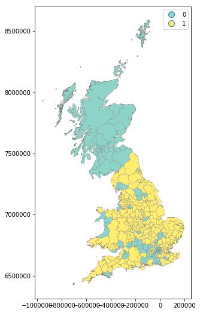

---
redirect_from:
  - "/notebooks/06-spatial-autocorrelation"
interact_link: content/notebooks/06_spatial_autocorrelation.ipynb
kernel_name: python3
has_widgets: false
title: 'Spatial Autocorrelation'
prev_page:
  url: /notebooks/05_choropleth
  title: 'Choropleth Mapping'
next_page:
  url: /notebooks/07_local_autocorrelation
  title: 'Local Spatial Autocorrelation'
comment: "***PROGRAMMATICALLY GENERATED, DO NOT EDIT. SEE ORIGINAL FILES IN /content***"
---

# Global Spatial Autocorrelation

## Spatial autocorrelation

The notion of spatial dependence or spatial autocorrelation relates to the existence of a "functional relationship between what happens at one point in space and what happens elsewhere" (Anselin, 1988). Spatial autocorrelation thus has to do with the degree to which the similarity in values between observations in a dataset is related to the similarity in locations of such observations. Not completely unlike (although there are some key differences) the traditional correlation between two variables -which informs us about how the values in one variable change as a function of those in the other- or its temporal counterpart -which relates the value of a variable at a given point in time with those in previous periods-, spatial autocorrelation relates the value of the variable of interest in a given location, with values of the same variable in other locations. An alternative way to understand the concept is as the degree of information contained in the value of a variable at a given location about the value of that same variable in other locations.

In order to understand better the notion of spatial autocorrelation, it is useful to begin by considering its absence. A key idea in this context is that of spatial randomness: a situation in which the location of an observation gives no information whatsoever about its value. In other words, a variable is spatially random if it is distributed following no discernible pattern over space. Spatial autocorrelation can thus be formally defined as the "absence of spatial randomness". This definition renders spatial autocorrelation as a very encompassing and daunting concept. To better understand it, spatial autocorrelation is typically categorized along two main dimensions: sign and scale.

Similar to the traditional, non-spatial case, spatial autocorrelation can adopt two main forms: **positive** and negative. The former relates to a situation where similarity and geographical closeness go hand-in-hand. In other words, similar values are located near each other, while different values tend to be scattered and further away. It is important that the sign of these values is not relevant for the presence of spatial autocorrelation: it may be high values close to high values, *or* low values close to low values. The important bit in this context is the relationship between closeness and statistical similarity is positive. This is a fairly common case in many social contexts and, in fact, several human phenomena display  clearly positive spatial autocorrelation. For example, think of the distribution of income, or poverty, over space: it is common to find similar values located nearby (wealthy areas close to other wealthy areas, poor population concentrated in space too). In contrast, **negative** spatial autocorrelation reflects a situation where similar values tend to be located away from each other. In this case, statistical similarity is associated with distance. This is a somewhat less common circumstance in the social sciences, but it still exist. An example can be found in phenomena that follow processes of spatial competition or situations where the location of a set of facilities aims at the highest spatial coverage. The distribution of supermarkets of different brands, or of hospitals usually follows a pattern of negative spatial dependence.

Spatial autocorrelation can also be delimited by the scale at which it is considered. We talk of global or local processes. **Global** spatial autocorrelation, on which this chapter is focused on, considers the overall trend that the location of values follows. In doing this, the study of global spatial autocorrelatio makes possible statements about the degree of *clustering* in the dataset. Do values generally follow a particular pattern in their geographical distribution? Are similar values closer to other similar values than we would expect from pure chance? These are some of the questions that relate to global spatial autocorrelation. **Local** autocorrelation focuses on deviations from the global trend at much more focused levels than the entire map, and it is the subject of the next chapter.


We will explore these concepts with an applied example, interrogating the data about the presence, nature, and strength of global spatial autocorrelation. To do this, we will use a set of tools collectively known as Exploratory Spatial Data Analysis (ESDA). Analogous to its non-spatial counterpart (EDA; Tukey, 1977), ESDA has been specifically designed for this purpose, and puts space and the relative location of the observations in a dataset at the forefront of the analysis. The range of ESDA methods is wide and spans from simpler approaches like choropleth maps (previous chapter), to more advanced and robust methodologies that include statistical inference and an explicit recognition of the geographical arrangement of the data. The purpose of this chapter is to dip our toes into the latter group.

## An empirical illustration: the EU Referendum

To illustrate the notion of spatial autocorrelation and its different variants, let us turn to an example with real world data. Before the data, let us import all the relevant libraries that we will use throughout the chapter:

<div markdown="1" class="cell code_cell">
<div class="input_area" markdown="1">
```python
# Graphics
%matplotlib inline
import matplotlib.pyplot as plt
import seaborn
from pysal.viz.splot.esda import plot_moran
import contextily
from contextily.tile_providers import ST_TERRAIN_BACKGROUND
# Analysis
import geopandas
import pandas
from pysal.explore import esda
from pysal.lib import weights
from numpy.random import seed
# Bespoke
import bookdata
from booktools import choropleth
```
</div>

</div>

In 2016, Great Britain ran a referendum to decide whether to remain in the European Union or to leave the club, the so called "Brexit" vote. We will use the official data from the Electoral Comission at the local authority level on percentage of votes for the Remain and Leave campains. There are two distinct datasets we will combine:

* Electoral Comission data on vote percentages at the local authority level. [[CSV]](http://www.electoralcommission.org.uk/__data/assets/file/0014/212135/EU-referendum-result-data.csv)
* ONS Local Authority Districts (December 2016) Generalised Clipped Boundaries in the UK WGS84. [[SHP]](https://data.gov.uk/dataset/65f48bab-e65f-491c-90f5-729eef098196/local-authority-districts-december-2016-generalised-clipped-boundaries-in-the-uk-wgs84)

To load it up, we can use the `bookdata` utility, which pulls the path to the file on your local machine. The vote results are stored in a `csv` file:

<div markdown="1" class="cell code_cell">
<div class="input_area" markdown="1">
```python
ref = pandas.read_csv(bookdata.brexit(), index_col='Area_Code')
ref.info()
```
</div>

<div class="output_wrapper" markdown="1">
<div class="output_subarea" markdown="1">
{:.output_stream}
```
<class 'pandas.core.frame.DataFrame'>
Index: 382 entries, E06000031 to E08000036
Data columns (total 20 columns):
id                         382 non-null int64
Region_Code                382 non-null object
Region                     382 non-null object
Area                       382 non-null object
Electorate                 382 non-null int64
ExpectedBallots            382 non-null int64
VerifiedBallotPapers       382 non-null int64
Pct_Turnout                382 non-null float64
Votes_Cast                 382 non-null int64
Valid_Votes                382 non-null int64
Remain                     382 non-null int64
Leave                      382 non-null int64
Rejected_Ballots           382 non-null int64
No_official_mark           382 non-null int64
Voting_for_both_answers    382 non-null int64
Writing_or_mark            382 non-null int64
Unmarked_or_void           382 non-null int64
Pct_Remain                 382 non-null float64
Pct_Leave                  382 non-null float64
Pct_Rejected               382 non-null float64
dtypes: float64(4), int64(13), object(3)
memory usage: 62.7+ KB
```
</div>
</div>
</div>

While the shapes of the geographical units (local authority districts, in this case) are stored in a compressed GeoJSON file. We can read it directly from the `.zip` file as follows:

<div markdown="1" class="cell code_cell">
<div class="input_area" markdown="1">
```python
lads = geopandas.read_file(bookdata.lads())\
                .set_index('lad16cd')
lads.info()
```
</div>

<div class="output_wrapper" markdown="1">
<div class="output_subarea" markdown="1">
{:.output_stream}
```
<class 'geopandas.geodataframe.GeoDataFrame'>
Index: 391 entries, E06000001 to W06000023
Data columns (total 10 columns):
objectid      391 non-null int64
lad16nm       391 non-null object
lad16nmw      22 non-null object
bng_e         391 non-null int64
bng_n         391 non-null int64
long          391 non-null float64
lat           391 non-null float64
st_areasha    391 non-null float64
st_lengths    391 non-null float64
geometry      391 non-null object
dtypes: float64(4), int64(3), object(3)
memory usage: 33.6+ KB
```
</div>
</div>
</div>

Although there are several variables that could be considered, we will focus on `Pct_Leave`, which measures the proportion of votes for the Leave alternative. For convenience, let us merge the vote results with the spatial data and project the output into the Spherical Mercator coordinate reference system (CRS), the preferred choice of web maps, which will allow us to combine them with contextual tiles later:

<div markdown="1" class="cell code_cell">
<div class="input_area" markdown="1">
```python
db = geopandas.GeoDataFrame(lads.join(ref[['Pct_Leave']]), crs=lads.crs)\
              .to_crs(epsg=3857)\
              [['objectid', 'lad16nm', 'Pct_Leave', 'geometry']]\
              .dropna()
db.info()
```
</div>

<div class="output_wrapper" markdown="1">
<div class="output_subarea" markdown="1">
{:.output_stream}
```
<class 'geopandas.geodataframe.GeoDataFrame'>
Index: 380 entries, E06000001 to W06000023
Data columns (total 4 columns):
objectid     380 non-null int64
lad16nm      380 non-null object
Pct_Leave    380 non-null float64
geometry     380 non-null object
dtypes: float64(1), int64(1), object(2)
memory usage: 14.8+ KB
```
</div>
</div>
</div>

<div markdown="1" class="cell code_cell">
<div class="input_area" markdown="1">
```python
lads.crs
```
</div>

<div class="output_wrapper" markdown="1">
<div class="output_subarea" markdown="1">


{:.output_data_text}
```
{'init': 'epsg:4326'}
```


</div>
</div>
</div>

<div markdown="1" class="cell code_cell">
<div class="input_area" markdown="1">
```python
db.crs
```
</div>

<div class="output_wrapper" markdown="1">
<div class="output_subarea" markdown="1">


{:.output_data_text}
```
{'init': 'epsg:3857', 'no_defs': True}
```


</div>
</div>
</div>

Throughout the chapter, we will rely heavily on geovisualizations. To create more useful maps that bring geographical context to the spatial distribution of votes, we will use an image made up of tiles from a web map. Let us first download it on-the-fly using `contextily`. The image will be reused later on in several maps.

**DA-B note**: update with `contextily.add_basemap` once it's released

<div markdown="1" class="cell code_cell">
<div class="input_area" markdown="1">
```python
we, so, ea, no = db.total_bounds
img, ext = contextily.bounds2img(we, so, ea, no, 6,
                         url=ST_TERRAIN_BACKGROUND)
lic = ("Map tiles by Stamen Design, under CC BY 3.0. "\
               "Data by OpenStreetMap, under ODbL.")
```
</div>

</div>

And with this elements, we can generate a choropleth to get a quick sense of the spatial distribution of the data we will be analyzing. Note how we use some visual tweaks (e.g. transparency through the `alpha` attribute) to make the final plot easier to read.

<div markdown="1" class="cell code_cell">
<div class="input_area" markdown="1">
```python
f, ax = plt.subplots(1, figsize=(9, 9))
ax.imshow(img, extent=ext, alpha=0.5)

choropleth(db, column='Pct_Leave', cmap='viridis', scheme='quantiles',
        k=5, edgecolor='white', linewidth=0., alpha=0.75, legend=True, ax=ax)

plt.text(ext[0],ext[2], lic, size=8)
ax.set_axis_off()
```
</div>

<div class="output_wrapper" markdown="1">
<div class="output_subarea" markdown="1">

{:.output_png}


</div>
</div>
</div>

The final piece we need before we can delve into autocorrelation is the spatial weights matrix. We will use eight nearest neighbors for the sake of the example, but the discussion in the earlier chapter on weights applies in this context, and other criteriums would be valid too. We also row-standardize them:

<div markdown="1" class="cell code_cell">
<div class="input_area" markdown="1">
```python
# Generate W from the GeoDataFrame
w = weights.Distance.KNN.from_dataframe(db, k=8)
# Row-standardization
w.transform = 'R'
```
</div>

</div>

## Global spatial autocorrelation

The map above is a good way to begin exploring the main spatial patterns in the data. At first sight, it appears to display a fair amount of positive spatial autocorrelation: local authorities with high percentages of votes to leave the EU tend to be next to each other (see, for instance, the eastern region), as are those where a much smaller proportion of their population voted to leave (with Scotland being a good example in the north). Humans however are very good pattern detectors. All over our history since we started as a species, life has rewarded pattern recognition abilities and punished individuals lacking it. Think of the advantage our ancestors had if they were able to spot particular shapes or movement when haunting, or the trouble they could get into if they were not able to recognize certain others in the darkness of night in the jungle. This extraordinary capability to spot trends, patterns and associations tends to also create many false positives: cases where we think there is a pattern but in fact what we are seeing is largely random. This is particularly accentuated in the case of maps where, as we have seen in the choropleth mapping chapter, the shape of geometries can also significantly distort our perception. By looking at the map above, for example, we can have an educated guess about the presence of spatial autocorrelation; but actually determining whether what we are seeing could have come from pure chance or not is usually easier said than done.

That is exactly the purpose of indicators of global spatial autocorrelation: to leverage the power of statistics to help us first summarize the spatial distribution of values present in a map, and second obtain a formal quantification of the departure from randomness. Statistics designed to measure this trend thus characterize a map in terms of its degree of clustering and summarize it, either in a visual or numerical way. However, before we can delve into the statistics, we need to understand a core building block: the spatial lag. With that concept under the belt, we are in a position to build a good understanding of global spatial autocorrelation. We will gently enter it with the binary case, when observations can only take two (potentially categorical) values, before we cover the two workhorses of the continous case: the Moran Plot and Moran's I.

### Spatial Lag

The spatial lag operator is one of the most common and direct applications of spatial weights matrices ($W$'s) in spatial analysis. The mathematical definition is the product of $W$ and the vector of a given variable. Conceptually, the spatial lag captures the behaviour of a variable in the inmediate surroundings of each location; in that respect, it is akin to a local smoother of a variable. 

We can formally express it in matrix notation as:

$$
Y_{sl} = W Y
$$

or, in individual notation as:

$$
y_{sl-i} = \sum_j w_{ij} y_j
$$

where $w_{ij}$ is the cell in $W$ on the $i$-th row and $j$-th column, thus capturing the spatial relationship between observations $i$ and $j$. $y_{sl-i}$ thus captures the product of the values and weights of each observation other than $i$ in the dataset. Because non-neighbors receive a weight of zero, $y_{sl-i}$ really captures the product of values and weights for $i$'s neighbors. If $W$ is binary, this will amount to the sum of the values of $i$'s neighbors (useful in some contexts, such as studies of market potential); if $W$ is row-standardised, a common transformation, $y_{sl-i}$ is bounded between zero and one; the spatial lag thus then becomes the average value of $Y$ in the neighbourhood of each observation $i$. This latter meaning is the one that will enable our analysis of spatial autocorrelation below.

As we will discover throughout this book, the spatial lag is a key element of many spatial analysis techniques and, as such, it is fully supported in PySAL. To compute the spatial lag of a given variable, `Pct_Leave` for example, we can do it as follows:

<div markdown="1" class="cell code_cell">
<div class="input_area" markdown="1">
```python
db['Pct_Leave_lag'] = weights.spatial_lag.lag_spatial(w, db['Pct_Leave'])
```
</div>

</div>

Let us peak into two local authority districts to get a better intuition of what is behind the spatial lag:

<div markdown="1" class="cell code_cell">
<div class="input_area" markdown="1">
```python
db.loc[['E08000012', 'S12000019'], 
       ['Pct_Leave', 'Pct_Leave_lag']]
```
</div>

<div class="output_wrapper" markdown="1">
<div class="output_subarea" markdown="1">


<div markdown="0" class="output output_html">
<div>
<style scoped>
    .dataframe tbody tr th:only-of-type {
        vertical-align: middle;
    }

    .dataframe tbody tr th {
        vertical-align: top;
    }

    .dataframe thead th {
        text-align: right;
    }
</style>
<table border="1" class="dataframe">
  <thead>
    <tr style="text-align: right;">
      <th></th>
      <th>Pct_Leave</th>
      <th>Pct_Leave_lag</th>
    </tr>
    <tr>
      <th>lad16cd</th>
      <th></th>
      <th></th>
    </tr>
  </thead>
  <tbody>
    <tr>
      <th>E08000012</th>
      <td>41.81</td>
      <td>54.61375</td>
    </tr>
    <tr>
      <th>S12000019</th>
      <td>37.94</td>
      <td>38.01875</td>
    </tr>
  </tbody>
</table>
</div>
</div>


</div>
</div>
</div>

The first row (`E08000012`) represents Liverpool, which was a notorious "remainer" island among the mostly-Leave North of England. Outside of London and Scotland, it was one of the few locations with less than majority to Leave. The second row (`S12000019`) represents Midlothian, in Scotland, where no local authority voted to leave. Although both Liverpool and Midlothian display a similar percentage of population who voted to leave (42% and 38%, respectively), the difference in their spatial lags captures the wider geographical context, which was rather opposite.

To end this section visually, the smoothing nature of the lag can be appreciated in the following map comparison:

<div markdown="1" class="cell code_cell">
<div class="input_area" markdown="1">
```python
lic = ("Map tiles by Stamen Design, under CC BY 3.0. \n"\
               "Data by OpenStreetMap, under ODbL.")
f, axs = plt.subplots(1, 2, figsize=(12, 6))
ax1, ax2 = axs

ax1.imshow(img, extent=ext, alpha=0.5)
choropleth(db, column='Pct_Leave', cmap='viridis', scheme='quantiles',
        k=5, edgecolor='white', linewidth=0., alpha=0.75, legend=True, ax=ax1)
ax1.text(ext[0],ext[2], lic, size=8)
ax1.set_axis_off()
ax1.set_title("% Leave")

ax2.imshow(img, extent=ext, alpha=0.5)
choropleth(db, column='Pct_Leave_lag', cmap='viridis', scheme='quantiles',
        k=5, edgecolor='white', linewidth=0., alpha=0.75, legend=True, ax=ax2)
ax2.text(ext[0],ext[2], lic, size=8)
ax2.set_axis_off()
ax2.set_title("% Leave - Spatial Lag")

plt.show()
```
</div>

<div class="output_wrapper" markdown="1">
<div class="output_subarea" markdown="1">

{:.output_png}


</div>
</div>
</div>

Stark differences on the left between immendiate neighbors (as in the case of Liverpool, in the NW of England) are diminished on the map in the right.

### Binary case: join counts

The spatial lag plays an important role in quantifying spatial autocorrelation. Using it, we can begin to put in relation the behaviour of a variable at a given location with its pattern in the immediate neighbourhood. Measures of global spatial autocorrelation will then use each observation to construct overall measures about the general trend in a given dataset. 

Our first dip into these measures considers a simplified case: binary values. This occurs when the variable we are interested in only takes two values. In this context, we are interested in whether a given observation is surrounded by others within the same category. For example, returning to our dataset, we want to assess the extent to which local authorities who voted to Leave tend to be surrounded by others who also voted to leave. To proceed, let us first calculate a binary variable (`Leave`) that indicates 1 if the local authority voted to leave, and zero otherwise:

<div markdown="1" class="cell code_cell">
<div class="input_area" markdown="1">
```python
db['Leave'] = (db['Pct_Leave'] > 50).astype(int)
db[['Pct_Leave', 'Leave']].tail()
```
</div>

<div class="output_wrapper" markdown="1">
<div class="output_subarea" markdown="1">


<div markdown="0" class="output output_html">
<div>
<style scoped>
    .dataframe tbody tr th:only-of-type {
        vertical-align: middle;
    }

    .dataframe tbody tr th {
        vertical-align: top;
    }

    .dataframe thead th {
        text-align: right;
    }
</style>
<table border="1" class="dataframe">
  <thead>
    <tr style="text-align: right;">
      <th></th>
      <th>Pct_Leave</th>
      <th>Leave</th>
    </tr>
    <tr>
      <th>lad16cd</th>
      <th></th>
      <th></th>
    </tr>
  </thead>
  <tbody>
    <tr>
      <th>W06000018</th>
      <td>57.63</td>
      <td>1</td>
    </tr>
    <tr>
      <th>W06000019</th>
      <td>62.03</td>
      <td>1</td>
    </tr>
    <tr>
      <th>W06000021</th>
      <td>49.56</td>
      <td>0</td>
    </tr>
    <tr>
      <th>W06000022</th>
      <td>55.99</td>
      <td>1</td>
    </tr>
    <tr>
      <th>W06000023</th>
      <td>53.74</td>
      <td>1</td>
    </tr>
  </tbody>
</table>
</div>
</div>


</div>
</div>
</div>

Which we can visualise readily:

<div markdown="1" class="cell code_cell">
<div class="input_area" markdown="1">
```python
db.plot(column='Leave', categorical=True, legend=True, 
        edgecolor='0.5', linewidth=0.25, cmap='Set3', 
        figsize=(9, 9));
```
</div>

<div class="output_wrapper" markdown="1">
<div class="output_subarea" markdown="1">

{:.output_png}


</div>
</div>
</div>

Visually, it appears that the map represents a clear case of positive spatial autocorrelation: overall, there are few visible cases where a given observation is surrounded by others in the opposite category. To formally explore this initial assessment, we can use what is called a "joint count" statistic (JC; Cliff & Ord 1981). Imagine a checkerboard with green (G, value 0) and yellow (Y, value 1) squares. The idea of the statistic is to count occurrences of green-green (GG), yellow-yellow (YY), or green-yellow/yellow-green (GY) joins (or neighboring pairs) on the map. In this context, both GG and YY reflect positive spatial autocorrelation, while GY captures its negative counterpart. The intuition of the statistic is to provide a baseline of how many GG, YY, and GY one would expect under the case of complete spatial randomness, and to compare this with the observed counts in the dataset. A situation where we observe more GG/YY than expected and less GY than expected would suggest positive spatial autocorrelation; while the oposite, more GY than GG/YY, would point towards negative spatial autocorrelation.

Since the spatial weights are only used here to delimit who is a neighbor or not, the joint count statistic requires binary weights. Let us thus transform `w` back to a non-standardised state:

<div markdown="1" class="cell code_cell">
<div class="input_area" markdown="1">
```python
w.transform
```
</div>

<div class="output_wrapper" markdown="1">
<div class="output_subarea" markdown="1">


{:.output_data_text}
```
'R'
```


</div>
</div>
</div>

<div markdown="1" class="cell code_cell">
<div class="input_area" markdown="1">
```python
w.transform = 'O'
```
</div>

</div>

<div markdown="1" class="cell code_cell">
<div class="input_area" markdown="1">
```python
w.transform
```
</div>

<div class="output_wrapper" markdown="1">
<div class="output_subarea" markdown="1">


{:.output_data_text}
```
'O'
```


</div>
</div>
</div>

We can compute the statistic as:

<div markdown="1" class="cell code_cell">
<div class="input_area" markdown="1">
```python
seed(1234)
jc = esda.join_counts.Join_Counts(db['Leave'], w)
jc
```
</div>

<div class="output_wrapper" markdown="1">
<div class="output_subarea" markdown="1">


{:.output_data_text}
```
<pysal.explore.esda.join_counts.Join_Counts at 0x7fce32051828>
```


</div>
</div>
</div>

As it is common throughout PySAL, we are creating an object (`jc`) that holds a lot of information beyond the value of the statistic calculated. For example, we can check how many occurrences of GG we have (note the attribute is `bb`, which originates from the original reference where the two considered classes were black and white):

<div markdown="1" class="cell code_cell">
<div class="input_area" markdown="1">
```python
jc.bb
```
</div>

<div class="output_wrapper" markdown="1">
<div class="output_subarea" markdown="1">


{:.output_data_text}
```
872.0
```


</div>
</div>
</div>

how many YY occurrences our map has:

<div markdown="1" class="cell code_cell">
<div class="input_area" markdown="1">
```python
jc.ww
```
</div>

<div class="output_wrapper" markdown="1">
<div class="output_subarea" markdown="1">


{:.output_data_text}
```
301.0
```


</div>
</div>
</div>

and how many GY/YG we find:

<div markdown="1" class="cell code_cell">
<div class="input_area" markdown="1">
```python
jc.bw
```
</div>

<div class="output_wrapper" markdown="1">
<div class="output_subarea" markdown="1">


{:.output_data_text}
```
347.0
```


</div>
</div>
</div>

The sum of those three gives us the total number of comparisons:

<div markdown="1" class="cell code_cell">
<div class="input_area" markdown="1">
```python
jc.bb + jc.ww + jc.bw
```
</div>

<div class="output_wrapper" markdown="1">
<div class="output_subarea" markdown="1">


{:.output_data_text}
```
1520.0
```


</div>
</div>
</div>

<div markdown="1" class="cell code_cell">
<div class="input_area" markdown="1">
```python
jc.J
```
</div>

<div class="output_wrapper" markdown="1">
<div class="output_subarea" markdown="1">


{:.output_data_text}
```
1520.0
```


</div>
</div>
</div>

The statistic is based on comparing the actual number of joins of each class (`bb`, `ww`, `bc`) with what one would expect in a case of spatial randomness. Those expectations can be accessed as well, for the GG/YY case:

<div markdown="1" class="cell code_cell">
<div class="input_area" markdown="1">
```python
jc.mean_bb
```
</div>

<div class="output_wrapper" markdown="1">
<div class="output_subarea" markdown="1">


{:.output_data_text}
```
727.46996996997
```


</div>
</div>
</div>

and for GY joins:

<div markdown="1" class="cell code_cell">
<div class="input_area" markdown="1">
```python
jc.mean_bw
```
</div>

<div class="output_wrapper" markdown="1">
<div class="output_subarea" markdown="1">


{:.output_data_text}
```
649.2542542542543
```


</div>
</div>
</div>

Statistical inference to obtain a sense of whether these values are likely to come from random chance or not can be accessed as:

<div markdown="1" class="cell code_cell">
<div class="input_area" markdown="1">
```python
jc.p_sim_bb
```
</div>

<div class="output_wrapper" markdown="1">
<div class="output_subarea" markdown="1">


{:.output_data_text}
```
0.001
```


</div>
</div>
</div>

<div markdown="1" class="cell code_cell">
<div class="input_area" markdown="1">
```python
jc.p_sim_bw
```
</div>

<div class="output_wrapper" markdown="1">
<div class="output_subarea" markdown="1">


{:.output_data_text}
```
1.0
```


</div>
</div>
</div>

These results point to a clear presence of positive spatial autocorrelation, as there are a lot more joins of pairs in the same category than one would expect (`p_sim_bb`) and significantly less of opposite joins (`p_sim_bw`).

### Continuous case: Moran Plot and Moran's I

Once we have built some intuition around how spatial autocorrelation can be formally assessed in the binary case, let us move to situations where the variable of interest does not only take two values, but is instead continuous. Probably the most commonly used statistic in this context is Moran's I (Moran, 1950), which can be written as:

$$
I = \dfrac{n}{\sum_i\sum_j w_{ij}} \dfrac{\sum_i\sum_j w_{ij} \, z_i \, z_j}{\sum_i z_i^2}
$$

where $n$ is the  number of observations, $z_{i}$ is the standardized value of the variable of interest at location $i$, and $w_{ij}$ is the cell corresponding to the $i$-th row and $j$-th column of a $W$ spatial weights matrix.

In order to understand the intuition behind its math, it is useful to begin with a graphical interpretation: the Moran Plot. The Moran Plot is a way of visualizing a spatial dataset to explore the nature and strength of spatial autocorrelation. It is essentially a traditional scatter plot in which the variable of interest is displayed against its *spatial lag*. In order to be able to interpret values as above or below the mean, and their quantities in terms of standard deviations, the variable of interest is usually standardized by substracting its mean and dividing it by its standard deviation:

<div markdown="1" class="cell code_cell">
<div class="input_area" markdown="1">
```python
db['Pct_Leave_std'] = ( db['Pct_Leave'] - db['Pct_Leave'].mean() )\
                    / db['Pct_Leave'].std()
db['Pct_Leave_lag_std'] = ( db['Pct_Leave_lag'] - db['Pct_Leave_lag'].mean() )\
                    / db['Pct_Leave_lag'].std()
```
</div>

</div>

Technically speaking, creating a Moran Plot is very similar to creating any other scatter plot in Python:

<div markdown="1" class="cell code_cell">
<div class="input_area" markdown="1">
```python
f, ax = plt.subplots(1, figsize=(6, 6))
seaborn.regplot(x='Pct_Leave_std', y='Pct_Leave_lag_std', 
                ci=None, data=db, line_kws={'color':'r'})
ax.axvline(0, c='k', alpha=0.5)
ax.axhline(0, c='k', alpha=0.5)
ax.set_title('Moran Plot - % Leave')
plt.show()
```
</div>

<div class="output_wrapper" markdown="1">
<div class="output_subarea" markdown="1">

{:.output_png}


</div>
</div>
</div>

The figure above displays the relationship between the standardized percentage to leave and its spatial lag which, because the $W$ used is row-standardized, can be interpreted as the average standardized density of the Pct_Leave in the neighborhood of each observation. In order to guide the interpretation of the plot, a linear fit is also included in the post, together with confidence intervals. This line represents the best linear fit to the scatter plot or, in other words, what is the best way to represent the relationship between the two variables as a straight line.

The plot displays a positive relationship between both variables. This is associated with the presence of positive spatial autocorrelation: similar values tend to be located close to each other. This means that the overall trend is for high values to be close to other high values, and for low values to be surrounded by other low values. This however does not mean that this is the only case in the dataset: there can of course be particular situations where high values are surrounded by low ones, and viceversa. But it means that, if we had to summarize the main pattern of the data in terms of how clustered similar values are, the best way would be to say they are positively correlated and, hence, clustered over space. In the context of the example, this can be interpreted along the lines of: local authorities where people voted in high proportion to leave the EU tend to be located nearby other regions that also registered high proportions of Leave vote. In other words, we can say the percentage of Leave votes is spatially autocorrelated in a positive way.

The Moran Plot is an excellent tool to explore the data and get a good sense of how much values are clustered over space. However, because it is a graphical device, it is sometimes hard to condense its insights into a more concise way. For these cases, a good approach is to come up with a statistical measure that summarizes the figure. This is exactly what Moran's I, as formally expressed above, is meant to do.

Very much in the same way the mean summarizes a crucial element of the distribution of values in a non-spatial setting, so does Moran's I for a spatial dataset. Continuing the comparison, we can think of the mean as a single numerical value summarizing a histogram or a kernel density plot. Similarly, Moran's I captures much of the essence of the Moran Plot. In fact, there is a close connection between the two: the value of Moran's I corresponds with the slope of the linear fit overlayed on top of the Moran Plot.

In order to calculate Moran's I in our dataset, we can call a specific function in PySAL directly (before that, let us row-standardised the `w` object again):

<div markdown="1" class="cell code_cell">
<div class="input_area" markdown="1">
```python
w.transform = 'R'
moran = esda.moran.Moran(db['Pct_Leave'], w)
```
</div>

</div>

The method `Moran` creates an object that contains much more information than the actual statistic. If we want to retrieve the value of the statistic, we can do it this way:

<div markdown="1" class="cell code_cell">
<div class="input_area" markdown="1">
```python
moran.I
```
</div>

<div class="output_wrapper" markdown="1">
<div class="output_subarea" markdown="1">


{:.output_data_text}
```
0.6436557633381564
```


</div>
</div>
</div>

The other bit of information we will extract from Moran's I relates to statistical inference: how likely is the pattern we observe in the map and Moran's I captures in its value to be generated by an entirely random process? If we considered the same variable but shuffled its locations randomly, would we obtain a map with similar characteristics? To obtain insight into these questions, PySAL performs a simulation and returns a measure of certainty about how likely it is the pattern we observe in our dataset came from a spatially random process. This is summarised in the `p_sim` attribute:

<div markdown="1" class="cell code_cell">
<div class="input_area" markdown="1">
```python
moran.p_sim
```
</div>

<div class="output_wrapper" markdown="1">
<div class="output_subarea" markdown="1">


{:.output_data_text}
```
0.001
```


</div>
</div>
</div>

The value is calculated as an empirical P-value that represents the proportion of realisations in the simulation under spatial randomness that are more extreme than the observed value. A small enough p-value associated with the Moran's I of a map allows to reject the hypothesis that the map is random. In other words, we can conclude that the map displays more spatial pattern than we would expect if the values had been randomly allocated to a locations.

That is a very low value, particularly considering it is actually the minimum value we could have obtained given the simulation behind it used 999 permutations (default in `PySAL`) and, by standard terms, it would be deemed statistically significant. We can ellaborate a bit further on the intuition behind the value of `p_sim`. If we generated a large number of maps with the same values but randomly allocated over space, and calculated the Moran's I statistic for each of those maps, only 0.01% of them would display a larger (absolute) value than the one we obtain from the observed data, and the other 99.99% of the random maps would receive a smaller (absolute) value of Moran's I. If we remember again that the value of Moran's I can also be interpreted as the slope of the Moran Plot, what we have is that, in this case, the particular spatial arrangement of values over space we observe for the percentage of Leave votes is more concentrated than if we were to randomly shuffle the vote proportions among the map, hence the statistical significance. As a first step, the global autocorrelation analysis can teach us that observations do seem to be positively autocorrelated over space. Indeed, the overall spatial pattern in the EU Referendum vote was highly marked: nearby areas tended to vote alike.

Thanks to the `splot` visualisation module in PySAL, we can obtain a quick representation of the statistic that combines the Moran Plot (right) with a graphic of the empirical test that we carry out to obtain `p_sim` (left):

<div markdown="1" class="cell code_cell">
<div class="input_area" markdown="1">
```python
plot_moran(moran);
```
</div>

<div class="output_wrapper" markdown="1">
<div class="output_subarea" markdown="1">

{:.output_png}


</div>
</div>
</div>

On the left panel we can see in grey the empirical distribution generated from simulating 999 random maps with the values of the `Pct_Leave` variable and then calculating Moran's I for each of those maps. The black rug signals the mean. In contrary, the red rug shows Moran's I calculated for the variable using the geography observed in the dataset. It is clear the value under the observed pattern is significantly higher than under randomness. This insight is confirmed on the right panel, where there is displayed an equivalent plot to the Moran Plot we created above.

### Other global indices

Moran's I is probably the most widely used statistic for global spatial autocorrelation, however it is not the only one. In this final part of the chapter, we introduce two additional measures proposed in the literature and also widely used. Althought they all consider spatial autocorrelation, they differ in how the concept is tackled in the specification of each test.

#### Geary's C

The contiguity ratio $c$, proposed by Geary (1954), is given by:

$$
C = \dfrac{(n-1)}
          {2 \sum_i \sum_j w_{ij}} 
    \dfrac{\sum_i \sum_j w_{ij} (y_i - y_{j})^2}
          {\sum_i (y_i - \bar{y})^2}
$$

where $n$ is the number of observations, $w_{ij}$ is the cell in a binary matrix $W$ expressing whether $i$ and $j$ are neighbours ($w_{ij}=1$) or not ($w_{ij}=1$), $y_i$ is the $i$-th observation of the variable of interest, and $\bar{y}$ is its sample mean. When compared to Moran's I, it is apparent both measures put in relation the behaviour of $Y$ within each observation's local neighbourhood with that over the entire sample. However, there are also subtle differences. While Moran's I takes cross-products on the standardised values, Geary's C uses differences on the values without any standardisation. The key implication this has is that, unlike Moran's I, Geary's C cannot distinguish between positive and negative spatial autocorrelation, as all the differences are squared, hence turning always into positive values.

Computationally, Geary's C is more demanding, but it can be easily computed using PySAL:

<div markdown="1" class="cell code_cell">
<div class="input_area" markdown="1">
```python
geary = esda.geary.Geary(db['Pct_Leave'], w)
```
</div>

</div>

Which has a similar way of accessing its estimate:

<div markdown="1" class="cell code_cell">
<div class="input_area" markdown="1">
```python
geary.C
```
</div>

<div class="output_wrapper" markdown="1">
<div class="output_subarea" markdown="1">


{:.output_data_text}
```
0.41016025947192414
```


</div>
</div>
</div>

Inference is performed in a similar way as with Moran. We can perform a simulation that allows us to draw an empirical distribution of the statistic under the null of spatial randomness, and then compare it with the statistic obtained when using the observed geographical distribution of the data. To access the pseudo p-value, calculated as in the Moran case, we can call `p_sim`:

<div markdown="1" class="cell code_cell">
<div class="input_area" markdown="1">
```python
geary.p_sim
```
</div>

<div class="output_wrapper" markdown="1">
<div class="output_subarea" markdown="1">


{:.output_data_text}
```
0.001
```


</div>
</div>
</div>

In this case, Geary's C points in the same direction as Moran's I: there is clear indication that the statistic we calculate on the observed dataset is different from what would be expected in a situation of pure spatial randomness. Hence, from this analysis, we can also conclude spatial autocorrelation is present.

#### Getis and Ord's G

Originally proposed by Getis & Ord (1992), the $G$ is the global version of a family of statistics of spatial autocorrelation based on distance. The $G$ class of statistics is conceived for points, hence the use of a distance $W$, but it can also be applied to lattice data if a binary spatial weights matrix can be constructed. Additionally, it is designed for the study of positive variables with a natural origin. The $G$ can be expressed as follows:

$$
G(d) = \dfrac{ \sum_i \sum_j w_{ij}(d) \, y_i \, y_j }
             { \sum_i \sum_j y_i \, y_j }
$$

where $w_{ij}(d)$ is the binary weight assigned on the relationship between observations $i$ and $j$ following a distance band criterium. $G$ was originally proposed as a measure of concentration rather than of spatial autocorrelation. As such, it is well suited to test to what extent similar values (either high or low) tend to co-locate. In other words, the $G$ is a statistic of *postive* spatial autocorrelation. This is usually the interest in most Geographic Data Science applications. However, it is important to note that, because $G$ can be understood as a measure of the intensity with which $Y$ is concentrated, the statistic is not able to pick up cases of *negative* spatial autocorrelation.

To illustrate its computation, let us calculate a binary distance band $W$. To make sure every observation has at least one neighbor, we will use the `min_threshold_distance` method and project the dataset into the Ordnance Survey CRS (`EPSG` code 27700), expressed in metres:

<div markdown="1" class="cell code_cell">
<div class="input_area" markdown="1">
```python
db_osgb = db.to_crs(epsg=27700)
pts = db_osgb.centroid
xys = pandas.DataFrame({'X': pts.x, 'Y': pts.y})
min_thr = weights.util.min_threshold_distance(xys)
min_thr
```
</div>

<div class="output_wrapper" markdown="1">
<div class="output_subarea" markdown="1">


{:.output_data_text}
```
181454.1951138063
```


</div>
</div>
</div>

For every local authority to have a neighbour, the distance band needs to at least be about 181 Km. This information can then be passed to the `DistanceBand` constructor:

<div markdown="1" class="cell code_cell">
<div class="input_area" markdown="1">
```python
w_db = weights.Distance.DistanceBand.from_dataframe(db_osgb, min_thr)
```
</div>

</div>

At this point, we are ready to calculate the global $G$ statistic:

<div markdown="1" class="cell code_cell">
<div class="input_area" markdown="1">
```python
gao = esda.getisord.G(db['Pct_Leave'], w_db)
```
</div>

</div>

Access to the statistic (`gao.G`) and additional attributes can be gained in the same way as with the previous statistics:

<div markdown="1" class="cell code_cell">
<div class="input_area" markdown="1">
```python
print("Getis & Ord G: %.3f | Pseudo P-value: %.3f"%(gao.G, gao.p_sim))
```
</div>

<div class="output_wrapper" markdown="1">
<div class="output_subarea" markdown="1">
{:.output_stream}
```
Getis & Ord G: 0.436 | Pseudo P-value: 0.002
```
</div>
</div>
</div>

Similarly, inference can also be carried out by relying on computational simulations that replicate several instances of spatial randomness using the values in the variable of interest, but shuffling their locations. In this case, the pseudo P-value computed suggests a clear departure from the hypothesis of no concentration.

## References

Anselin, L. (1988). Lagrange multiplier test diagnostics for spatial dependence and spatial heterogeneity. Geographical analysis, 20(1), 1-17.

Cliff, A. D., and J. K. Ord. 1981. Spatial Processes, Models & Applications. London: Pion.

Geary, R. (1954). The Contiguity Ratio and Statistical Mapping. The Incorporated Statistician, 5(3), 115-146. doi:10.2307/2986645

Getis, A., & Ord, J. K. (1992). The analysis of spatial association by use of distance statistics. Geographical analysis, 24(3), 189-206.

Moran, P. A. (1950). Notes on continuous stochastic phenomena. Biometrika, 37(1/2), 17-23.

Tukey, J. W. (1977). Exploratory data analysis (Vol. 2).
